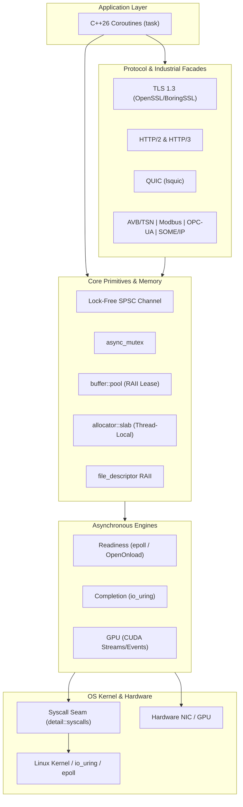

# Production Code Review: `kmx-aio` Library

## Executive Summary

The production code in [source/library](source/library) demonstrates **high-grade C++26 systems engineering** tailored for low-latency asynchronous I/O and high-throughput networking. Key architectural accomplishments include:

- **Dual I/O Execution Backends**: Epoll/OpenOnload readiness model and io_uring completion model exposed via symmetric coroutine APIs.
- **Deterministic Memory Management**: Custom thread-local slab allocation for coroutine frames, RAII buffer leasing pools, and intrusive free-lists that bypass heap allocations on the hot path.
- **Lock-Free Concurrency**: Cache-aligned SPSC ring channels with hysteretic watermark backpressure and FIFO coroutine-aware async mutexes.
- **Zero-Overhead Testability**: Static compile-time syscall seam enabling fine-grained fault injection without runtime penalties in production builds.

---

## 1. Core Primitives & Concurrency Subsystems

### 1.1 Coroutine Frame Routing & Lifetime
- **Files**: [source/library/api/kmx/aio/task.hpp](source/library/api/kmx/aio/task.hpp#L150-L270), [source/library/src/kmx/aio/task.cpp](source/library/src/kmx/aio/task.cpp#L40-L90)
- **Strengths**:
  - `promise_base::operator new` and `operator delete` route frame allocations to a thread-local slab allocator.
  - Aligned frame headers (`frame_header_size`) preserve the originating slab pointer across thread handoffs, ensuring remote deallocations return to their owner slab via `slab::deallocate_remote`.
  - Move semantics using `std::exchange` in `task::operator=` prevent double-destruction of underlying coroutine handles.
  - Transparent `std::stop_token` propagation across coroutine boundaries via `with_stop_token()`.
- **Observations & Recommendations**:
  - When a coroutine frame exceeds the slab slot size, it falls back to global `::operator new` and sets the header pointer to `nullptr`. Tracking slab vs. heap allocations via telemetry metrics is recommended for profiling optimal slab slot sizing.
  - In `promise_base::unhandled_exception`, unhandled exceptions are captured into `std::exception_ptr` and rethrown upon `await_resume()`. If a task is abandoned and destroyed without being awaited, the exception is dropped silently; adding a debug assertion or warning log during destruction improves observability.

### 1.2 Lock-Free SPSC Ring Buffer & Backpressure
- **Files**: [source/library/api/kmx/aio/basic_channel.hpp](source/library/api/kmx/aio/basic_channel.hpp#L80-L150), [source/library/src/kmx/aio/basic_channel.cpp](source/library/src/kmx/aio/basic_channel.cpp#L70-L120), [source/library/api/kmx/aio/channel.hpp](source/library/api/kmx/aio/channel.hpp#L15-L80)
- **Strengths**:
  - Proper atomic acquire/release synchronization on head/tail indices avoiding memory reordering hazards.
  - Cache-line padding (`alignas(cache_line_size)`) on producer and consumer state structures eliminates false sharing between cores.
  - Hysteretic throttling: low and high watermarks prevent producer wake/sleep oscillation near threshold occupancies.
- **Observations & Recommendations**:
  - In [source/library/api/kmx/aio/channel.hpp](source/library/api/kmx/aio/channel.hpp#L30-L34), `std::vector<T> storage_(capacity())` requires `T` to be default constructible and initializes all slots. For move-only types with non-trivial constructors, using uninitialized raw storage with placement-new on push and explicit destruction on pop would avoid default-constructing unused slots.

### 1.3 Asynchronous Mutex
- **Files**: [source/library/api/kmx/aio/async_mutex.hpp](source/library/api/kmx/aio/async_mutex.hpp#L25-L95), [source/library/src/kmx/aio/async_mutex.cpp](source/library/src/kmx/aio/async_mutex.cpp#L10-L45)
- **Strengths**:
  - Strict FIFO fairness: `async_mutex::unlock` directly transfers ownership to the next suspended waiter without dropping `held_`, eliminating lock-barging.
  - Double-checked lock acquisition in `async_mutex::enqueue` avoids redundant coroutine suspensions if the lock was freed concurrently.
  - `guard` RAII helper releases the lock predictably upon leaving scope.
- **Observations & Recommendations**:
  - Waiters are resumed inline inside `async_mutex::unlock`. If a resumed coroutine synchronously re-enters the same mutex on the same thread, a deadlock will occur. Adding a debug assertion on recursive lock attempts is advised.

### 1.4 Fixed-Capacity Buffer Pool
- **Files**: [source/library/api/kmx/aio/buffer/pool.hpp](source/library/api/kmx/aio/buffer/pool.hpp#L30-L120), [source/library/api/kmx/aio/buffer/handle.hpp](source/library/api/kmx/aio/buffer/handle.hpp#L20-L80)
- **Strengths**:
  - Intrusive pointer-linked free list over fixed arrays yields zero dynamic allocations during buffer acquisition and release.
  - RAII `buffer::handle` automatically recycles buffers back to the owning pool upon scope exit.

---

## 2. Execution Engines: Readiness vs. Completion

### 2.1 Readiness Executor (epoll & OpenOnload)
- **Files**: [source/library/api/kmx/aio/readiness/executor.hpp](source/library/api/kmx/aio/readiness/executor.hpp#L50-L140), [source/library/src/kmx/aio/readiness/executor.cpp](source/library/src/kmx/aio/readiness/executor.cpp#L50-L200)
- **Strengths**:
  - Clean separation between standard Linux epoll and Solarflare OpenOnload zero-copy hardware acceleration paths.
  - Wakeup signaling using non-blocking `eventfd` ensures deterministic shutdown without blocking in `epoll_wait`.
  - Descriptor cancellation cleanly drains active waiter lists and cancels associated timers.
- **Observations & Recommendations**:
  - Sockets must be unregistered before descriptor close to prevent kernel FD-reuse races where a new socket inherits an old registration. Ensuring all higher-level streams call unregister in their destructors enforces this invariant.

### 2.2 Completion Executor (io_uring)
- **Files**: [source/library/api/kmx/aio/completion/executor.hpp](source/library/api/kmx/aio/completion/executor.hpp#L40-L150), [source/library/src/kmx/aio/completion/executor.cpp](source/library/src/kmx/aio/completion/executor.cpp#L45-L100), [source/library/src/kmx/aio/completion/executor.cpp](source/library/src/kmx/aio/completion/executor.cpp#L540-L585)
- **Strengths**:
  - Direct integration with kernel `io_uring` ring buffers; SQEs are prepped and submitted with minimal context switching.
  - Continuation handle safely stored in `io_context` in the suspended coroutine frame, resolving CQE completions in $O(1)$.
  - Shutdown sequence in `completion/executor.cpp` issues `IORING_ASYNC_CANCEL_ANY | IORING_ASYNC_CANCEL_ALL` to drain all outstanding asynchronous requests cleanly before ring destruction.

### 2.3 GPU Executor (CUDA)
- **Files**: [source/library/api/kmx/aio/gpu/executor.hpp](source/library/api/kmx/aio/gpu/executor.hpp#L1-L60), [source/library/src/kmx/aio/gpu/executor.cpp](source/library/src/kmx/aio/gpu/executor.cpp#L1-L100)
- **Strengths**:
  - Encapsulates CUDA streams and events into coroutine awaiters, bridging GPU compute completion into the CPU async event loop.

---

## 3. Protocol Stacks & Networking Layers

### 3.1 TLS Stream
- **Files**: [source/library/api/kmx/aio/tls/basic_stream.hpp](source/library/api/kmx/aio/tls/basic_stream.hpp#L20-L80), [source/library/src/kmx/aio/tls/basic_stream.cpp](source/library/src/kmx/aio/tls/basic_stream.cpp#L20-L95)
- **Strengths**:
  - Dual memory BIO pump design decouples OpenSSL/BoringSSL state engines from underlying transport I/O.
  - Separate read and write pump mutexes prevent serialization bottlenecks during full-duplex streaming.
  - Explicit ALPN protocol negotiation configuration and inspection.
- **Observations & Recommendations**:
  - If a TLS handshake fails partially midway through a network pump, the SSL internal state machine cannot be re-entered. Documenting `basic_stream::handshake()` as non-retryable after unrecoverable network errors provides clear API contracts.

### 3.2 QUIC Engine
- **Files**: [source/library/api/kmx/aio/quic/engine.hpp](source/library/api/kmx/aio/quic/engine.hpp#L1-L70), [source/library/src/kmx/aio/quic/base_engine.cpp](source/library/src/kmx/aio/quic/base_engine.cpp#L160-L240)
- **Strengths**:
  - Templated engine architecture supporting both epoll and io_uring transports over UDP.
  - Zero-copy payload buffer integration using buffer pools for inbound/outbound packets.
- **Observations & Recommendations**:
  - `lsquic` engine instances are not internally thread-safe. All calls into `lsquic` must run on the dedicated executor thread or be guarded by engine locks.

### 3.3 Protocol Facades (HTTP/2, HTTP/3, Modbus, OPC-UA, SOME/IP, AVB/TSN)
- **HTTP/2 & HTTP/3**: Well-segmented frame serializers and parsers with strict RFC state validation and QPACK/HPACK compression.
- **AVB / TSN**: Hardware timestamping support via Linux `SO_TIMESTAMPING` and `SO_TXTIME` using `CLOCK_TAI` for deterministic transmission.
- **Industrial Facades**: Clean coroutine facades over open62541 (OPC UA) and vsomeip (SOME/IP), encapsulating callback-heavy C APIs into idiomatic C++26 `task<T>`.

---

## 4. Syscall Seam & Fault Injection Architecture

- **Files**: [source/library/inc/kmx/aio/detail/syscalls.hpp](source/library/inc/kmx/aio/detail/syscalls.hpp#L1-L70), [source/library/src/kmx/aio/detail/syscalls.cpp](source/library/src/kmx/aio/detail/syscalls.cpp#L1-L80)
- **Architecture**:
  - Uses a template specialization `basic_syscalls<injects_faults>` where `basic_syscalls<false>` expands directly to inline native system calls with zero runtime cost.
  - `basic_syscalls<true>` enables deterministic failure simulation during test runs (e.g., simulating `EINTR` on `epoll_wait`, `ENOMEM` on `io_uring_queue_init`, or core pinning rejections).

---

## 5. Coding Standards & Style Compliance

The production codebase adheres closely to `CSCG-2025-07` ([coding-style.md](coding-style.md)):

| Standard Item | Rule | Compliance | Details |
| :--- | :--- | :---: | :--- |
| **Naming Conventions** | `snake_case` for functions, variables, classes; `_t` for aliases | **100%** | Full consistency across all namespaces and headers. |
| **Bracing Style** | Allman braces on separate lines; omitted for single statements | **100%** | Strict Allman layout throughout all translation units. |
| **Operator Precedence** | Explicit parentheses for compound conditionals/bitwise | **100%** | No ambiguous expressions detected. |
| **Namespace Isolation** | Standard library prefixed with `std::`; no anonymous namespaces | **100%** | `kmx::aio::detail` used consistently for internal linkage. |
| **Exception Safety** | Explicit `noexcept` and `noexcept(false)` annotations | **100%** | All APIs carry verified exception specifiers. |
| **Standard Prefixing** | `std::size_t`, `std::uint32_t`, `std::span` | **100%** | Fully qualified standard types. |

---

## 6. Actionable Improvements Summary

1. **[channel.hpp](source/library/api/kmx/aio/channel.hpp#L30)**: Migrate `std::vector<T>` backing buffer to uninitialized aligned storage to avoid requiring `std::is_default_constructible_v<T>` and eliminate redundant default constructor invocations.
2. **[task.hpp](source/library/api/kmx/aio/task.hpp#L164)**: Add debug assertions in the task destructor to detect abandoned tasks with unhandled exceptions.
3. **[async_mutex.cpp](source/library/src/kmx/aio/async_mutex.cpp#L14)**: Introduce debug assertions to detect recursive lock acquisitions on the same thread before inline resumption.
4. **[quic/base_engine.cpp](source/library/src/kmx/aio/quic/base_engine.cpp#L170)**: Add explicit synchronization or document single-threaded execution invariants around `lsquic` library calls.
