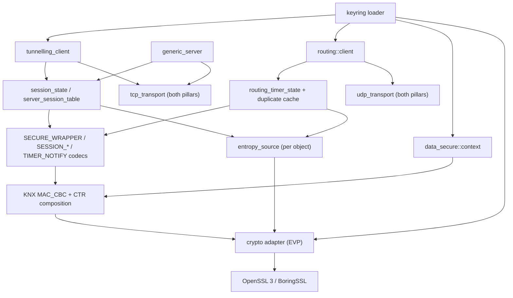
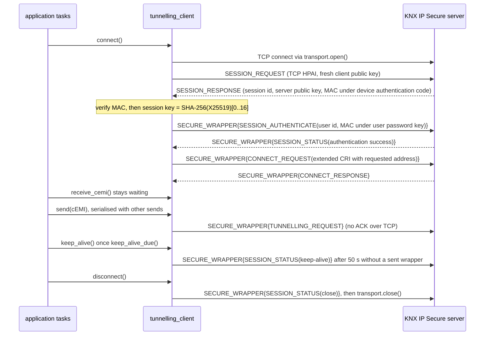

# KNX Secure support in kmx-aio

**Scope.** Replace the placeholder secure surface in `kmx-aio-knx` with real KNX Secure on both executor
pillars:

- an ETS keyring reader
- KNX IP Secure routing
- KNXnet/IP over TCP
- KNX IP Secure tunnelling, client and server
- KNX Data Secure group communication

**Deliverable of this phase.** This implementation plan. No code.
**Design point.** The primitives come from the project's existing TLS backend (OpenSSL 3 or BoringSSL). KNX's
own constructions are composed on top of them in-tree, and checked against two independent implementations.
Nothing ships under a KNX Secure name until its vectors, its negative tests and an external interop row are
all green.
**Status.** Draft for approval.

- Repository facts were checked on 2026-09-10 at `4437a8d`.
- Protocol constants were cross-checked the same day against xknx `main` (MIT), the Calimero READMEs and
  the Wireshark KNXnet/IP dissector documentation.
- Line-count estimates are planning signals, not acceptance criteria.

**Review corrections (2026-09-10).** A review against the code and the protocol sources changed this plan in
the following ways.

- **Keep-alive could not work as first written.**
  - `tunnelling_client::poll()` is synchronous.
  - The client's one-operation gate refuses every other call while a receive is waiting.
  - So on a quiet bus the secure session would expire after 60 s.
  - §3.7 and D11 now make periodic work on stream transports send-only, serialised by `async_mutex`.
- **Shared state had no synchronisation.** Both executors can resume coroutines on several worker threads.
  D12 and §3.7 now serialise the spawned server loops and secure routing state.
- **The TCP connection lifecycle was missing.**
  - A reconnect needs a new TCP connection and a new session, but the client holds its transport by
    reference.
  - `datagram_transport` gains `open()`, `close()` and `stream_oriented()` (§5.3).
- **An existing interop bug blocks the interop rows.**
  - Every non-zero `connect_status` value in `connection.hpp` differs from KNXnet/IP (§3.8).
  - Phase 0a now fixes it before any interop work.
- **Readiness can already open a TCP connection.** `modbus/client.cpp:36-78` does it. Phase 4a now extracts
  that code instead of writing a new helper.
- **Security requirements were implicit.** §2.1 adds a threat model per profile, and §2.2 lists ten required
  properties, including no downgrade, verify before state, no PBKDF2 on network input, and no global crypto
  hooks.
- **Smaller corrections.**
  - Keep-alive is sent after 50 s *without sending anything*, not every 50 s.
  - TCP tunnels keep the CONNECTIONSTATE heartbeat and still count the send sequence (§4.6).
  - The extended CRI is six octets.
  - Routing would accept a replay inside the latency tolerance, so D17 adds a duplicate cache.
  - The existing "IP Secure" and "Data Secure" matrix rows are split rather than duplicated.
  - The BoringSSL build now runs its tests.
  - The largest PR is split in two.

**Relationship to `knx-support-plan.md`.** This document expands three parts of that plan: its Phase 6
("KNX Secure"), and its §4.0 gates "Security release scope" and "Crypto boundary". That plan's rule that
Secure starts only after completion parity is green still applies; confirm it before Phase 1.

**Contents.** §1 where the tree stands · §2 decisions, threat model, required properties · §3 findings that
shape the design · §4 protocol reference · §5 architecture and public API · §6 phases · §7 test map ·
§8 verification · §9 risks · §10 out of scope · §11 execution board

---

## 1. Where the tree stands

The KNX product has a *seam* where Secure would plug in, but no cryptography behind it:

| Surface | What it is today | Evidence |
| :--- | :--- | :--- |
| `secure::provider` | virtual `protect` / `unprotect(payload, sequence)`; no implementation ships | `source/library/api/kmx/aio/knx/secure.hpp:209-232` |
| Secure envelope | invented layout on the unassigned service `0xFF00`: profile, reserved octet, 64-bit sequence, length, payload; no MAC | `secure.hpp:43-48`, `source/library/src/kmx/aio/knx/secure.cpp:37-115` |
| Real SECURE_WRAPPER `0x0950` | refused with `error::secure_unsupported` | `source/library/src/kmx/aio/knx/datagram.cpp:166-167` |
| Session and timer services `0x0951`–`0x0955` | absent | grep over the KNX sources |
| Keyring | scans a `<Key key="hex" encrypted-key="hex">` format this repo invented; decryption is delegated to the caller | `keyring.hpp`, `keyring.cpp` |
| Crypto library | none linked by `kmx-aio-knx` | `source/library/prj/knx.qbs` |
| Secure in server, routing, gateway | none | grep: zero matches |
| Conformance gates | pin the placeholder envelope using pass-through and XOR-mask test doubles | `script/feature/knx/run-release-gates.sh:25-26`, `.github/workflows/ci-knx.yml:41-46`, `documentation/features/knx/conformance/keyrings/passwords.tsv` |

Checking the seam turned up the defects below. Each one is a reason to replace the seam rather than fill it
in.

1. **The provider signature cannot express KNX Secure.** No header, session id, serial number or message tag
   reaches it, and its sequence is 64 bits where KNX uses 48.
2. **The sequence restarts under the same key.** `tunnelling_client` resets the secure sequence and replay
   window on every `connect()`, `reset()` and `shutdown()`, while the configured key stays the same
   (`client.cpp:500,523,746,753`). Behind any real cipher this reuses nonces, and it would accept packets
   from an earlier session again.
3. **Control traffic is in the clear.** Only data-channel packets are wrapped; CONNECT, CONNECTIONSTATE and
   DISCONNECT are not (`client.cpp:235-243`).
4. **Retries repeat the same bytes.** A request is wrapped once and retried byte for byte
   (`client.cpp:552-563`). After a lost ACK, the peer's replay check rejects the retry.
5. **`keyring::parse()` rejects every real keyring.** It returns `malformed_frame` for the repo's own
   `reference-clear.knxkeys` and for any ETS export, because `find("<Key")` (`keyring.cpp:138`) also matches
   the `<Keyring` root element. Confirmed with a small probe program.
6. **The security decisions are not written down.** `documentation/features/knx.md` records none of the
   §4.0 security decisions the support plan requires.
7. **The connection status codes are wrong, outside Secure too.** Every non-zero `connect_status` value
   differs from KNXnet/IP, and real codes outside the six the enum names are rejected (§3.8).

The tree already has these pieces, and this plan builds on them:

- **Crypto is already linked.**
  - `readiness.qbs:22`, `completion.qbs:23` and `unit-test.qbs:38` link `project.tls_libraries`, and
    `core.qbs` carries `tls_include_paths`.
  - `project.tls_backend` is OpenSSL, or BoringSSL when QUIC is enabled (`source/source.qbs:307`,
    `documentation/architecture.md:140`).
- **Both backends expose the EVP calls KNX needs.**
  - The calls: `EVP_PKEY_X25519`, `EVP_PKEY_derive`, `PKCS5_PBKDF2_HMAC`, `EVP_aes_128_{ecb,cbc,ctr}`,
    `EVP_Digest`, `RAND_bytes`, `CRYPTO_memcmp`, `OPENSSL_cleanse`.
  - Present in the system OpenSSL 3.0.13 headers and in `output/boringssl/include`.
- **TCP is available on both pillars.**
  - Each has `tcp::listener::accept()` and a `tcp::stream` that adopts an already-connected descriptor.
  - Completion has `executor::async_connect` (`completion/executor.hpp:130`).
  - Readiness has `file_descriptor::connect`, which tolerates `EINPROGRESS` (`file_descriptor.cpp:188-201`).
  - `modbus/client.cpp:36-78` completes that non-blocking connect with `wait_io(fd, event_type::write)`
    and `SO_ERROR`, but that code is private to the Modbus client.
- **An accept-and-spawn server pattern exists** in `source/library/src/kmx/aio/modbus/server.cpp:81-89`.
- **A coroutine mutex exists.** `source/library/api/kmx/aio/async_mutex.hpp` is a mutex a coroutine can hold
  across a suspension.
- **Typed DIBs are in place**, including SECURED_SERVICE_FAMILIES (`0x06`) and `dib::serial_number_t`
  (`dib.hpp:147`).
- **A TLS fault-injection seam exists** (`source/library/inc/kmx/aio/tls/detail/tls_syscalls.hpp`). However,
  `enable_fault_injection` does not compile at HEAD, so this plan cannot rely on it (§9).

And these constraints come with it:

- **Coroutines may resume on worker threads.**
  - Readiness defaults to `resumption_mode::scheduler` (`readiness/executor.hpp:78`).
  - Both executors take a `thread_count` (`readiness/executor.hpp:70`, `completion/executor.hpp:30`).
- **The tunnelling client runs one public operation at a time.**
  - An atomic gate enforces this (`client.hpp:79-80,386`; `knx.md:195-198`).
  - `poll()` is synchronous (`client.hpp:143`), and `heartbeat()` is a gated coroutine (`client.hpp:218`).
- **The routing client has no operation gate at all.** Nothing in `routing.cpp` serialises its callers.

---

## 2. Decisions proposed

Approve or amend these before Phase 0. Each one becomes a normative entry in `documentation/features/knx.md`.

| # | Decision | Choice | Why |
| :--- | :--- | :--- | :--- |
| D1 | Placeholder surface | **Delete it, don't extend it.** That covers `secure::provider`, the `0xFF00` envelope, `secure::packet` in `datagram_payload`, `replay_window_state`, both copies of `secure_vectors.hpp`, the invented keyring format, the XOR conformance bundles, and their scripts and CI steps. | The seam cannot carry KNX Secure (§3.1). It never protected anything, so there is nothing to stay compatible with, and a green gate on it misreports coverage. |
| D2 | Profiles and order | ETS keyring → IP Secure routing → KNXnet/IP over TCP → IP Secure tunnelling client → IP Secure tunnelling server → Data Secure group communication | Every profile needs the keyring. Secure routing needs no new transport, so it gives the first external proof of the crypto core. Tunnelling needs TCP first. |
| D3 | Crypto source | The project's TLS backend, through the EVP calls both OpenSSL 3 and BoringSSL provide. No in-tree AES, SHA-2, PBKDF2 or X25519. | These primitives are already linked and widely reviewed. Only KNX's composition of them is written here. |
| D4 | KNX's CCM variant | Built from AES-128-CBC (for the MAC) and AES-128-CTR, not from a library CCM or AEAD | KNX builds its first MAC block (B₀) and pads its associated data differently from RFC 3610, and BoringSSL has no general CCM mode (§3.2). |
| D5 | Build gate | **None.** Secure compiles into `kmx-aio-knx`, and `knx.qbs` adds `project.tls_include_paths` and `project.tls_libraries` to the product and its Export. | Every binary already links the TLS backend. `source.qbs:39-44` records why an earlier gate that selected no code was removed. |
| D6 | Header hygiene | No `<openssl/*>` include under `api/kmx/aio/knx/**`; the crypto adapter lives in `inc/` and `src/` | Keeps the OpenSSL/BoringSSL symbol clash (`source.qbs:301-306`) out of KNX's public API. |
| D7 | Key handling | Keys are held in a move-only `secure::secret_key` that wipes itself. MACs are compared with `CRYPTO_memcmp`, randomness comes from `RAND_bytes`, and no key octets appear in errors or logs (§2.2 P7, P9). | Standard hygiene, and what the support plan's §4.0 "zeroization review" gate asks for. |
| D8 | Password cost | PBKDF2 (65 536 iterations) runs when configuration is built. Every API also accepts the already-derived 16-octet key. Server configuration accepts derived keys only (§2.2 P4). | Keeps tens of milliseconds of hashing per password off the executor thread, and out of reach of anything a peer sends. |
| D9 | Transport for secure tunnelling | KNXnet/IP over TCP, as a `datagram_transport` that reassembles frames from the stream and reports `stream_oriented()`. The transport owns connecting, through `open()` and `close()`. The host protocol follows the transport, not a separate configuration field. Secure tunnelling over UDP waits until an interop peer is named. | xknx implements secure tunnelling over TCP and rebuilds its transport on reconnect, and calimero-server offers TCP. Deriving the protocol from the transport removes a setting that could disagree with it. |
| D10 | Clocks | Secure components take a 64-bit millisecond clock, `std::uint64_t (*)() noexcept`. The existing 32-bit clocks stay as they are. | The routing timer is a 48-bit millisecond value, and `std::uint32_t` wraps after 49.7 days (§3.4). |
| D11 | Periodic work | The library still owns no timers. The synchronous `poll()` reports what has expired and what is due. Send-only coroutines do the sending: `keep_alive()` on the client, `notify_timer()` on the router, and `heartbeat()` too on stream transports. Replies are absorbed by whichever receive is active. On stream transports, sends are serialised by an `async_mutex`, and the receive path keeps a single owner. UDP clients keep today's single-operation model. | Matches the "no background timers" rule in `knx.md`, and works while a receive is waiting (§3.7). |
| D12 | TCP server concurrency | A pillar-specific accept loop spawns one serve loop per connection. Each loop calls an executor-neutral `generic_server::serve_connection(datagram_transport&)`. The channel and session tables are guarded by an `async_mutex` that is never held across network I/O. | The same shape as `modbus/server.cpp:81-89`. The guard is needed because executors can resume those loops on several threads (§3.7). |
| D13 | Data Secure sequence persistence | The library exposes a `sequence_store` hook that reserves sequence numbers in blocks. Without one, the first value is the number of milliseconds since 2018-01-05T00:00:00Z, read from an injected wall clock. | A sender's sequence must never repeat across restarts. xknx uses the same time-based default. |
| D14 | Keyring XML | An in-tree, bounded reader for a strict subset of XML, plus fuzzing. It handles elements, attributes, the XML declaration, comments, the five predefined entities and numeric character references. It rejects DOCTYPE, ENTITY, processing instructions other than the declaration, and CDATA. Attribute values are entity-decoded before they are hashed for the signature. | Keeps the existing "no general XML parser for key material" stance, with a reader that actually handles ETS output. The alternative, expat, adds a dependency. |
| D15 | Evidence | Every profile needs byte vectors from an independent implementation (a pinned xknx version) and an external interop row (xknx or Calimero). Loopback rows are recorded but never count as interoperability. | Continues the support plan's §4.7 rule. |
| D16 | Certification | An explicit non-goal, as in `knx-support-plan.md` §8 | KNX certification is a membership and testing process, not an I/O library's release criterion. |
| D17 | Routing duplicates | Secure routing keeps a bounded cache of recently accepted (serial number, message tag, timer value) triples covering the latency tolerance, and drops exact repeats. | The acceptance rule alone accepts a replay anywhere inside the tolerance window (§4.3). A frame another router forwards gets its own serial number and timer, so only replays and network duplicates are exact repeats. |
| D18 | Connection status codes | Renumber `connect_status` to the KNXnet/IP values and accept every defined code. This lands as its own PR before any interop work (Phase 0a). | Today's values differ from the protocol for every refusal (§3.8), and refusals are exactly what interop and a secure server exercise. |
| D19 | Crypto test injection | Randomness and key-pair generation are injected per object, through `secure::entropy_source`. Backend failure paths are tested by passing a failing call table to `detail` functions. The shipped library has no process-wide hook. | A settable global would let any code in the process replace the RNG of every secure endpoint (§2.2 P6). |

### 2.1 Security goals and threat model

**Adversary.** An attacker on the IP network who holds no keys, and who can read, inject, replay, delay and
drop packets.

**Out of scope:**

- attackers who hold a legitimate key (KNX shares group and backbone keys among many devices by design)
- attackers who can read process memory
- traffic analysis
- denial of service, beyond keeping resource use bounded

| Profile | Protects | Does not protect |
| :--- | :--- | :--- |
| IP Secure tunnelling | Confidentiality, integrity and freshness of every frame between client and interface. The client authenticates the interface (device authentication code), and the interface authenticates the user (user password). Recorded sessions stay confidential if a password leaks later, because every session key comes from fresh X25519 key pairs (P3). | Traffic after the interface forwards it to the bus; that needs Data Secure. Availability: anyone on the path can reset the TCP connection. A client with `skip_device_authentication` set can be intercepted by an active attacker. |
| IP Secure routing | Confidentiality and integrity of multicast traffic among holders of the backbone key; freshness within the latency tolerance; exact replays inside that window, through D17 | Any holder of the backbone key can forge any router's frames, because there is no per-sender authentication. No forward secrecy, because the backbone key is static. |
| Data Secure (group) | End-to-end integrity, and optionally confidentiality, of group telegrams across routers, gateways and the bus. Replay protection per sender. | A holder of a group key can send telegrams claiming another sender's address, because addresses are not bound to per-sender keys. Addresses, and the fact that a telegram is secured, stay visible. No forward secrecy. |
| ETS keyring | Keys at rest, under the keyring password; tampering, through the signature | Weak keyring passwords: 65 536 PBKDF2 iterations slow guessing but do not stop it. Keys once they are loaded into process memory. |

### 2.2 Required properties

These are normative. Phase 8's security review checks each one, and the phases below add tests where a test
can show the property holds.

1. **P1 No downgrade.**
   - An endpoint configured for a secure profile never sends or accepts that profile's unencrypted
     equivalent.
   - A failed, refused or timed-out handshake leaves it closed.
   - A SECURED_SERVICE_FAMILIES block read from an unauthenticated SEARCH or DESCRIPTION never relaxes the
     requirement.
2. **P2 Verify before state.** No sequence table, timer offset, session state, duplicate cache or counter
   other than a failure statistic changes before the MAC verifies.
3. **P3 Fresh key pairs.** Every session, on client and server, generates a new X25519 key pair. A reconnect
   is a new session.
4. **P4 No password hashing on network input.** Server configuration holds derived keys only, so no frame a
   peer sends can reach PBKDF2. The types enforce this.
5. **P5 Bounded unauthenticated work.**
   - Sessions awaiting authentication are limited globally and per peer address.
   - A TIMER_NOTIFY is sent only in response to an authenticated frame, and at most one is pending.
6. **P6 No global crypto hooks.** Randomness and key pairs are injected per object (D19).
7. **P7 Key lifetime.**
   - Keys live in `secret_key` or `secret_string`, owned by long-lived objects.
   - Coroutine frames hold references to keys, never copies, because frames are heap-allocated and are not
     wiped.
   - Wiping is best effort; copies inside the backend are out of reach.
8. **P8 Unique serial numbers.**
   - Every secure endpoint is configured with a non-zero KNX serial number, and there is no library default.
   - A default shared by every instance, like xknx's single constant, breaks own-frame filtering between
     two instances.
9. **P9 Uniform verification failures.**
   - MACs are compared in constant time.
   - Every MAC failure returns `secure_authentication_failed` along the same path, so a caller cannot learn
     which part of a frame failed.
10. **P10 Observable failures.** Every rejection increments a `secure::statistics` counter (§5.7).

---

## 3. Findings that shape the design

### 3.1 The seam cannot be filled in

A KNX IP Secure MAC authenticates two fields as associated data: the six-octet wrapper header and the two-octet
session id. Its nonce is built from a 48-bit sequence, a six-octet serial number and a two-octet message tag.
`provider::protect(cspan_uint8_t packet, std::uint64_t sequence)` receives none of those. So no
implementation behind it could produce a SECURE_WRAPPER that a real device accepts.

Data Secure needs even more in its first MAC block (B₀): the source and destination addresses, the address
type, the frame format and the TPCI. None of those reach the seam either. Replacing it is less work than
widening it until it is no longer a seam.

### 3.2 KNX's CCM is not RFC 3610 CCM

xknx builds the MAC like this:

1. Concatenate `B₀ ‖ len₁₆(A) ‖ A ‖ P`, where A is the associated data and P the payload.
2. Zero-pad the whole string to a multiple of 16 octets.
3. Encrypt it with AES-128-CBC and a zero IV; the MAC is the last block.
4. Encrypt the MAC with the first AES-128-CTR keystream block, starting from `Ctr₀`, and the payload with
   the blocks that follow.

RFC 3610 is different: it puts flags in B₀, and it pads A separately from P. So neither OpenSSL's CCM mode nor
BoringSSL's fixed-parameter CCM AEADs can be used, and the construction is assembled from CBC and CTR (D4).
Because that composition is written in-tree, it is the part that needs independent vectors and a security
review (Phase 1, Phase 8).

### 3.3 Secure tunnelling needs TCP, and the KNX layer is UDP-only

- **No stream transport.** `datagram_transport` (`transport.hpp:81-137`) is datagram-shaped, and it has no
  notion of opening or closing a connection.
- **Host protocol hard-coded to UDP.** `0x01` is fixed in at least six checks: `server.cpp:15,26,185` and
  `client.cpp:419,437,478`.
- **CRI cannot name an address.** The tunnelling CRI is fixed at four octets (`connection.hpp:150-158`,
  `04 04 02 00`). A keyring binds each user id to a tunnel individual address, which needs the six-octet
  extended CRI (§4.6).
- **Different tunnelling rules over TCP.**
  - xknx neither sends nor waits for TUNNELLING_ACK over TCP, and does not validate the receive sequence
    counter.
  - It still counts the send sequence and runs the CONNECTIONSTATE heartbeat.
  - The session layer assumes ACKs throughout (`session.hpp:319-328`, `tunnelling_config::ack_timeout_ms`).
- **Readiness connect is private.** Readiness's working non-blocking connect lives inside the Modbus client
  (`modbus/client.cpp:36-78`).
- **One transport per server.** The server holds one transport and one receive buffer
  (`server.hpp:246-250`), but TCP gives it one transport per connection.

### 3.4 A 32-bit millisecond clock cannot run the routing timer

Secure routing uses the sender's timer value, in milliseconds, as the wrapper's 48-bit sequence information.
Followers move their clock offset forward to the highest authenticated value they see.

Every KNX clock today is `std::uint32_t (*)() noexcept` (`client.hpp:44`, `server.hpp:42`,
`routing.hpp:37`). That wraps after 49.7 days. When it wraps, the timer jumps backwards, and every peer on the
multicast group immediately rejects the node's frames as replays. Data Secure's time-based starting sequence
has the same need for a 64-bit clock, hence D10.

### 3.5 An ETS keyring is a different document

An ETS keyring has nothing in common with the current scanner's format:

- **Structure.** `Keyring`, `Backbone`, `Interface`, `GroupAddresses/Group` and `Devices/Device` elements,
  with base64 attribute values.
- **Encryption.** Values are AES-128-CBC-encrypted under a key derived with PBKDF2, with an IV taken from the
  `Created` attribute.
- **Signature.** The whole document is signed over a canonical stream of its elements and attributes.

The scanner's only search target also collides with the root element (§1, defect 5). Phase 2 replaces it.

### 3.6 The current gates would keep passing while the real work lands

`run-release-gates.sh` and `ci-knx.yml` run "secure conformance" against the placeholder. Left in place, they
would stay green through every phase below. That is exactly the false-coverage failure `source.qbs:39-44`
describes. Phase 0b removes them before anything new is claimed.

### 3.7 Concurrency and connection lifecycle

**A quiet bus would expire the session.**

- A secure session times out after 60 s without traffic.
- A supervisor keeps it alive by sending, but `tunnelling_client` refuses every public operation while another
  is outstanding (`client.hpp:79-80`).
- `poll()` is synchronous (`client.hpp:143`), so it cannot send anything.
- An application waiting in `receive_cemi()` for the next telegram therefore cannot keep the session alive.
  On a quiet bus, the session expires.
- `knx.md:195-198` already tells UDP users to add an external coordinator for this. For a secure session it is
  a correctness requirement, not a convenience.

**Over a stream, periodic work needs no reply path of its own.**

- A keep-alive has no reply, and TCP tunnelling has no TUNNELLING_ACK.
- `receive_cemi()` already absorbs CONNECTIONSTATE_RESPONSE through the session supervisor
  (`knx.md:211-212`).
- So on stream transports, sends can run beside a waiting receive:
  - an `async_mutex` serialises the sends
  - the receive keeps its single owner
  - `poll()` turns a missing reply into a failure (D11)

**Shared state meets worker threads.** Coroutines may resume on scheduler workers (`resumption_mode::scheduler`
is the readiness default, and both executors take `thread_count`). Three places share state across
coroutines:

- the per-connection server loops, which share the channel and session tables
- a secure router's receive and notify paths, which share timer state, and `routing::client` has no gate
  today
- a secure client's senders, which share the send sequence

Each needs an `async_mutex` that is never held across I/O, and ThreadSanitizer runs with `thread_count = 2`.

**A reconnect needs a new connection and a new session.** xknx rebuilds its TCP transport and its secure
session on every reconnect. `tunnelling_client` holds `datagram_transport&` and cannot swap it. So the
contract gains `open()` and `close()`, and a TCP transport can reconnect in place (§5.3).

### 3.8 The connection status codes are wrong today

This predates Secure and affects unencrypted KNXnet/IP too. Sources: xknx `xknx/knxip/error_code.py`, and the
Wireshark KNXnet/IP dissector documentation for `0x22` and `0x24`.

| Octet | This repo (`connection.hpp:38-54`) | KNXnet/IP |
| :--- | :--- | :--- |
| `0x01` | not accepted | E_HOST_PROTOCOL_TYPE |
| `0x02` | not accepted | E_VERSION_NOT_SUPPORTED |
| `0x04` | not accepted | E_SEQUENCE_NUMBER |
| `0x21` | `host_protocol_type` | E_CONNECTION_ID |
| `0x22` | `version_not_supported` | E_CONNECTION_TYPE |
| `0x23` | `sequence_number` | E_CONNECTION_OPTION |
| `0x24` | `connection_type` | E_NO_MORE_CONNECTIONS |
| `0x25` | `connection_option` | E_NO_MORE_UNIQUE_CONNECTIONS |
| `0x26` | `no_more_connections` | E_DATA_CONNECTION |
| `0x27`, `0x28`, `0x29`, `0x2D`, `0x2E` | not accepted | E_KNX_CONNECTION, E_AUTHORISATION_ERROR, E_TUNNELLING_LAYER, E_NO_TUNNELLING_ADDRESS, E_CONNECTION_IN_USE |

Consequences:

- **Refusals our server sends are misread.** It refuses an unusable HPAI with `0x21`, which a real client
  reads as E_CONNECTION_ID. A "server full" refusal is `0x26`, read as E_DATA_CONNECTION.
- **Refusals from real servers are misread or rejected.**
  - A real interface's E_NO_MORE_CONNECTIONS (`0x24`) decodes as `connection_type`.
  - Its E_KNX_CONNECTION (`0x27`) from CONNECTIONSTATE is rejected as malformed, because `valid_status`
    (`connection.cpp:12-26`) accepts only the six values above. So is E_AUTHORISATION_ERROR (`0x28`).
- **The tests hide it.**
  - `server_test.cpp:449,609`, `datagram_test.cpp:148-152` and `client_test.cpp:86,206` pin the wrong
    values.
  - An in-tree client and server agree with each other and disagree with every other implementation, which
    is the failure `knx.md` warns about in its wire-format notes.

CONNECTIONSTATE_RESPONSE and DISCONNECT_RESPONSE carry the same enum (`connection.hpp:213,230`). Phase 0a fixes
all of this before any interop row depends on a refusal or a heartbeat failure.

---

## 4. Protocol reference

The values below were cross-checked on 2026-09-10 against these files in xknx `main`:

- `xknx/secure/security_primitives.py`
- `xknx/io/ip_secure.py`
- `xknx/io/const.py`
- `xknx/io/tunnel.py`
- `xknx/secure/data_secure.py`
- `xknx/secure/data_secure_asdu.py`
- `xknx/secure/keyring.py`
- `xknx/knxip/knxip_enum.py`
- `xknx/knxip/error_code.py`
- `xknx/knxip/connect_request.py`

The normative sources are KNX System Specifications 03/08/02 "Core", 03/08/04 "Tunnelling", 03/08/09
"KNXnet/IP Security", and the KNX Secure application notes. Phase 0b records the specification clause behind
each row. A row that cannot be tied to a clause is marked *interop-derived*.

### 4.1 Services

| Service | Type | Total length | Body |
| :--- | :--- | :--- | :--- |
| SECURE_WRAPPER | `0x0950` | 38 + n | session id 2 · sequence information 6 · serial number 6 · message tag 2 · encrypted frame n · MAC 16 |
| SESSION_REQUEST | `0x0951` | 46 | control HPAI 8 (TCP: protocol `0x02`, zero address) · client X25519 public key 32 |
| SESSION_RESPONSE | `0x0952` | 56 | session id 2 · server X25519 public key 32 · MAC 16 |
| SESSION_AUTHENTICATE | `0x0953` | 24 | reserved 1 · user id 1 · MAC 16 |
| SESSION_STATUS | `0x0954` | 8 | status 1 · reserved 1 |
| TIMER_NOTIFY | `0x0955` | 36 | timer value 6 · serial number 6 · message tag 2 · MAC 16 |

SESSION_STATUS codes are `0x00` authentication success, `0x01` authentication failed, `0x02` unauthenticated,
`0x03` timeout, `0x04` keep-alive and `0x05` close. DIB `0x06` SECURED_SERVICE_FAMILIES lists the service
families a server offers only over a secure connection; `dib.hpp` already decodes it.

### 4.2 Primitives and derivations

| Name | Definition |
| :--- | :--- |
| `MAC_CBC(K, B₀, A, P)` | the last 16 octets of AES-128-CBC(K, IV = 0¹⁶, zero-pad(B₀ ‖ len₁₆(A) ‖ A ‖ P)) |
| `CTR(K, Ctr₀, M, P)` | AES-128-CTR starting from Ctr₀, with a 128-bit big-endian counter: the first block encrypts M, the following blocks encrypt P |
| Session key | the first 16 octets of SHA-256(X25519(client private key, server public key)) |
| Device authentication code | PBKDF2-HMAC-SHA256(password, `device-authentication-code.1.secure.ip.knx.org`, 65 536, 16) |
| User password key | PBKDF2-HMAC-SHA256(password, `user-password.1.secure.ip.knx.org`, 65 536, 16) |
| Keyring password hash | PBKDF2-HMAC-SHA256(password, `1.keyring.ets.knx.org`, 65 536, 16) |

### 4.3 KNX IP Secure

| Frame | Key | Associated data A | B₀ | Ctr₀ |
| :--- | :--- | :--- | :--- | :--- |
| SECURE_WRAPPER | session key (routing: backbone key) | wrapper header 6 ‖ session id 2 | seq 6 ‖ serial 6 ‖ tag 2 ‖ len₁₆(plain frame) | seq ‖ serial ‖ tag ‖ `FF 00` |
| SESSION_RESPONSE MAC | device authentication code | `06 10 09 52 00 38` ‖ session id ‖ (client public key ⊕ server public key) | 0¹⁶ | 0¹⁴ ‖ `FF 00` |
| SESSION_AUTHENTICATE MAC | user password key | `06 10 09 53 00 18` ‖ `00` ‖ user id ‖ (client public key ⊕ server public key) | 0¹⁶ | 0¹⁴ ‖ `FF 00` |
| TIMER_NOTIFY MAC | backbone key | `06 10 09 55 00 24` | timer 6 ‖ serial 6 ‖ tag 2 ‖ `00 00` | timer ‖ serial ‖ tag ‖ `FF 00` |

Rules:

**Session handshake.**

- SESSION_AUTHENTICATE is sent inside a SECURE_WRAPPER under the new session key. So is everything after it,
  SESSION_STATUS included.

**Sequence handling.**

- The session sequence starts at 0 and increases by one per frame.
- An incoming wrapper is accepted only if its sequence is strictly greater than the last one accepted. This
  plan checks the sequence *after* MAC verification (P2).
- Tunnelling frames use message tag `00 00`.

**Session lifetime.**

- A session times out after 60 s without traffic.
- The client sends a SESSION_STATUS keep-alive once 50 s have passed without it sending a wrapper. Every
  wrapper it sends restarts that interval.
- A SESSION_STATUS of close, timeout or unauthenticated ends the session.

**Plain and forbidden services.**

- SEARCH, SEARCH_EXTENDED and DESCRIPTION requests and responses stay unencrypted.
- A SECURE_WRAPPER containing another SECURE_WRAPPER, or REMOTE_DIAG_REQUEST/RESPONSE,
  REMOTE_CONFIG_REQUEST or REMOTE_RESET_REQUEST, is refused.

**Routing.**

- *Wrapper fields.* The session id is 0, and the sequence information is the sender's timer value in
  milliseconds.
- *Tolerances.* The latency tolerance comes from the keyring's `Backbone Latency` attribute (default
  1000 ms). The sync latency tolerance is 10 % of it.
- *Accepting a wrapper.* A received wrapper is accepted if its timer is ahead of the local timer, in which
  case the local offset moves forward to match. It is also accepted if it is behind by no more than the
  latency tolerance.
- *Rejecting a wrapper.* Otherwise the wrapper is dropped and a TIMER_NOTIFY update is scheduled.
- *Duplicates.* That rule has no duplicate check, and xknx implements none. So a frame replayed inside the
  tolerance window is accepted again; D17 adds the cache that stops this.
- *Notify timing.* Timekeeper and follower delays follow xknx's `SecureGroup` constants. The periodic notify
  is at least 10 s and the update notify at least 100 ms, each plus multiples of the sync latency tolerance,
  with a random spread.
- *Ordering.* Timer state, the duplicate cache and notify scheduling change only after MAC verification (P2).

### 4.4 KNX Data Secure (group communication)

| Item | Value |
| :--- | :--- |
| APCI | `0x3F1`, in the `0x3C0` escape family (`cemi.hpp:460`) |
| Security control field (SCF) | bit 7 tool access · bits 6–4 algorithm (`000` authentication only, `001` authentication + confidentiality) · bit 3 system broadcast · bits 2–0 service (`000` S-A_Data, `010` S-A_Sync_Req, `011` S-A_Sync_Res) |
| Secured data | sequence number 6 ‖ secured APDU ‖ MAC 4 |
| B₀ | seq 6 ‖ source 2 ‖ destination 2 ‖ `00` ‖ (address type ∣ frame format) ‖ ((TPCI ≪ 2) + `03`) ‖ `F1` ‖ `00` ‖ payload length |
| Ctr₀ | seq 6 ‖ source 2 ‖ destination 2 ‖ `00 00 00 00 01 00` |
| Authentication + confidentiality | A = SCF, P = plain APDU. The MAC is truncated to 4 octets, then the MAC and the APDU are CTR-encrypted. |
| Authentication only | A = SCF ‖ plain APDU, P is empty, and the MAC is truncated to 4 octets. Phase 7 vectors pin whether the MAC is CTR-encrypted in this mode. |
| Key | the group key of the destination group address |
| Receive rule | The sender must be in the security individual address table, and the sequence must be strictly greater than that sender's last valid value. The table is updated only after the MAC verifies. A telegram delivered out of order is therefore dropped. |
| Allowed senders | The keyring's `Interface/Group Senders` attribute lists who may send to each group. Enforcement is optional (§5.3). |
| Not implemented by xknx | S-A_Sync_Req/Res, tool access, point-to-point |

### 4.5 ETS keyring

| Item | Value |
| :--- | :--- |
| Elements and attributes | `Keyring` (Project, CreatedBy, Created, Signature, xmlns) · `Backbone` (MulticastAddress, Latency, Key) · `Interface` (Type, IndividualAddress, Host, UserID, Password, Authentication), with `Group` children (Address, Senders) · `GroupAddresses/Group` (Address, Key) · `Devices/Device` (IndividualAddress, ToolKey, ManagementPassword, Authentication, SequenceNumber) |
| Decryption | AES-128-CBC. The key is the keyring password hash; the IV is the first 16 octets of SHA-256(`Created`); the input is base64-decoded first. |
| Keys | a single 16-octet block |
| Passwords | Drop the 8-octet random prefix and the padding its last octet counts, then decode as UTF-8. The padding is not PKCS#7: ETS repeats only the final count, and ETS 5.7.5 and earlier pad every password to two blocks, so the count can exceed 16 (found by the fixtures in Phase 2). |
| Signature | SHA-256 over this stream: for each start element, `01`, the element name, then its attributes sorted by name, excluding `xmlns` and `Signature`, as name and value; for each end element, `02`; at the end of the document, base64(password hash). The first 16 octets of the digest must equal the base64-decoded `Signature`. Strings carry a one-octet length prefix and are hashed after entity decoding; the exact framing is taken from xknx's `KeyringSAXContentHandler` and pinned by the fixtures. A wrong password fails here, before anything is decrypted. |

### 4.6 KNXnet/IP over TCP, connection status codes, CRI

| Rule | Value | Source |
| :--- | :--- | :--- |
| TUNNELLING_ACK over TCP | not sent, not awaited | xknx `TCPTunnel` (*interop-derived* until pinned to 03/08/04) |
| Send sequence counter over TCP | still incremented per request, modulo 256 | xknx `_Tunnel.send_cemi` |
| Receive sequence counter over TCP | not validated | xknx `TCPTunnel` |
| CONNECTIONSTATE heartbeat over TCP | kept | xknx `_Tunnel`, citing 03/08/02 §5.4 |
| HPAI over TCP | protocol `0x02`, address and port zero | xknx |
| Reconnect | a new TCP connection and, when secure, a new session | xknx `_Tunnel.connect` rebuilds the transport |
| Extended CRI | six octets: `06` · connection type `04` · KNX layer · `00` · individual address 2 | xknx `ConnectRequestInformation` (`CRI_TUNNEL_EXT_LENGTH = 6`) |

| Code | Name |
| :--- | :--- |
| `0x00` | E_NO_ERROR |
| `0x01` | E_HOST_PROTOCOL_TYPE |
| `0x02` | E_VERSION_NOT_SUPPORTED |
| `0x04` | E_SEQUENCE_NUMBER |
| `0x21` | E_CONNECTION_ID |
| `0x22` | E_CONNECTION_TYPE |
| `0x23` | E_CONNECTION_OPTION |
| `0x24` | E_NO_MORE_CONNECTIONS |
| `0x25` | E_NO_MORE_UNIQUE_CONNECTIONS |
| `0x26` | E_DATA_CONNECTION |
| `0x27` | E_KNX_CONNECTION |
| `0x28` | E_AUTHORISATION_ERROR |
| `0x29` | E_TUNNELLING_LAYER |
| `0x2D` | E_NO_TUNNELLING_ADDRESS |
| `0x2E` | E_CONNECTION_IN_USE |

xknx also defines `0x0F` (E_ERROR). Pin it to the specification before adding it. Phase 6 pins which code a
secure server returns to an unencrypted CONNECT; the candidates are E_CONNECTION_TYPE and
E_AUTHORISATION_ERROR.

---

## 5. Architecture

### 5.1 Layers

```text
api/kmx/aio/knx/secure/*.hpp            public and OpenSSL-free: secret_key, entropy_source, credentials, statistics, codecs
api/kmx/aio/knx/keyring.hpp             ETS keyring model and loader (replaces the scanner)
api/kmx/aio/knx/data_secure.hpp         Data Secure context and cEMI transform
inc/kmx/aio/knx/secure/detail/*.hpp     crypto adapter (EVP), KNX MAC/CTR composition, xml_reader
inc/kmx/aio/knx/secure/*_state.hpp      I/O-free state machines: client session, server session table, routing timer, duplicate cache
inc/kmx/aio/knx/detail/frame_reassembler.hpp   pure TCP frame reassembly
src/kmx/aio/knx/secure/*.cpp            implementations
api/kmx/aio/{readiness,completion}/knx/tcp_transport.hpp   stream adapters (open, close, reassembly)
api/kmx/aio/{readiness,completion}/knx/tcp_server.hpp      accept-and-spawn loops
```



The layering rule from the support plan still holds. **State machines take time and randomness as
parameters, and never touch a socket or the crypto backend directly.** They call the KNX composition layer,
which is pure except for the adapter underneath it.

Client session over TCP:



### 5.2 Crypto adapter

The adapter is one internal header, `inc/kmx/aio/knx/secure/detail/crypto.hpp`, and one translation unit.
Every function is `noexcept` and returns `std::expected<…, std::error_code>`:

`aes128_cbc_mac`, `aes128_ctr`, `aes128_cbc_decrypt`, `sha256`, `pbkdf2_hmac_sha256`, `x25519_generate`,
`x25519_derive`, `random_bytes`, `constant_time_equal`, `cleanse`.

- **No shared state.** EVP contexts are created and freed inside each call, and nothing is cached between
  calls, so there is no thread-safety question.
- **Randomness per object.** Randomness and key pairs reach state machines through `secure::entropy_source`,
  passed to each endpoint. The production implementation, `system_entropy()`, calls the backend. A test
  passes its own source, so fixed-key vectors run through the real code (D19).
- **Failure paths.** Each public adapter function forwards to a `detail::basic_*` function that takes the
  backend call table as a parameter. Production passes a `constexpr` table of real calls; tests call the
  `basic_*` functions with failing stubs. Nothing is installed globally, so this does not depend on
  `enable_fault_injection` (§9).

### 5.3 Public API sketches

These follow house style; bodies are omitted.

```cpp
namespace kmx::aio::knx::secure
{
    /// @brief A 16-octet AES-128 key, zeroised on destruction and never copied implicitly.
    class secret_key final
    {
    public:
        static constexpr std::size_t size = 16u;

        secret_key() noexcept = default;
        explicit secret_key(std::span<const std::uint8_t, size> octets) noexcept;
        secret_key(const secret_key&) = delete;
        secret_key& operator=(const secret_key&) = delete;
        secret_key(secret_key&& other) noexcept;
        secret_key& operator=(secret_key&& other) noexcept;
        ~secret_key() noexcept;

        [[nodiscard]] secret_key clone() const noexcept;
        [[nodiscard]] bool empty() const noexcept;
    };

    /// @brief A decrypted keyring password, zeroised on destruction; move-only like secret_key.
    class secret_string;

    /// @brief An X25519 key pair; the private half is zeroised on destruction.
    struct x25519_key_pair;

    /// @brief Where a secure endpoint gets random octets and X25519 key pairs.
    /// @details Injected per object and never installed globally; null selects system_entropy().
    class entropy_source
    {
    public:
        virtual ~entropy_source() noexcept = default;
        [[nodiscard]] virtual expected_void_t fill(span_uint8_t destination) noexcept = 0;
        [[nodiscard]] virtual std::expected<x25519_key_pair, std::error_code> generate_key_pair() noexcept = 0;
    };

    [[nodiscard]] entropy_source& system_entropy() noexcept;

    /// @brief 64-bit monotonic milliseconds; null selects the steady clock.
    using monotonic_ms_function = std::uint64_t (*)() noexcept;
    /// @brief Milliseconds since the Unix epoch; null selects the system clock.
    using wall_clock_ms_function = std::uint64_t (*)() noexcept;

    [[nodiscard]] std::expected<secret_key, std::error_code> derive_user_password_key(std::string_view password) noexcept;
    [[nodiscard]] std::expected<secret_key, std::error_code> derive_device_authentication_code(std::string_view password) noexcept;

    /// @brief What a client needs to open a KNX IP Secure session.
    struct tunnelling_credentials
    {
        std::uint8_t user_id {};
        secret_key user_password_key {};
        secret_key device_authentication_code {};
        /// @brief Skips SESSION_RESPONSE verification; a named opt-out, off by default, and a MITM exposure.
        bool skip_device_authentication {};
        /// @brief This client's KNX serial number; required and non-zero (P8).
        dib::serial_number_t serial_number {};
    };
}

namespace kmx::aio::knx::keyring
{
    // As built in Phase 2. An Interface element is not always a tunnel - ETS also exports USB and backbone
    // interfaces - so the model follows the element rather than the tunnelling case.
    enum class interface_type : std::uint8_t { tunnelling, usb, backbone };
    struct backbone { ipv4::storage_t multicast_address {224u, 0u, 23u, 12u}; std::uint16_t latency_ms = 1000u; secure::secret_key key {}; };
    struct group_senders { group_address address {}; std::vector<individual_address> senders {}; };
    struct interface_entry { interface_type type {}; individual_address address {}; std::optional<individual_address> host {}; std::optional<std::uint8_t> user_id {}; secure::secret_string user_password {}; secure::secret_string device_authentication {}; std::vector<group_senders> groups {}; };
    struct group_key { group_address address {}; secure::secret_key key {}; };
    struct device { individual_address address {}; secure::secret_key tool_key {}; secure::secret_string management_password {}; secure::secret_string authentication {}; std::uint64_t sequence_number {}; };

    struct document
    {
        std::string project {}, created_by {}, created {};
        std::optional<backbone> backbone_entry {};
        std::vector<interface_entry> interfaces {};
        std::vector<group_key> group_keys {};
        std::vector<device> devices {};
    };

    [[nodiscard]] std::expected<document, std::error_code> load(std::string_view xml, std::string_view password) noexcept(false);
    [[nodiscard]] std::expected<document, std::error_code> load(std::string_view xml, const secure::secret_key& password_hash) noexcept(false);

    // Both refuse an all-zero serial number with invalid_configuration (P8), and a missing slot or backbone
    // with secure_key_missing. The routing result type lives in secure/credentials.hpp, not routing.hpp.
    [[nodiscard]] secure::tunnelling_credentials_result_t credentials_for(
        const document& value, individual_address tunnel_address, const secure::serial_number_t& serial_number) noexcept;
    [[nodiscard]] secure::routing_configuration_result_t routing_configuration_for(
        const document& value, const secure::serial_number_t& serial_number) noexcept;
}
```

Passwords stay in the document as `secret_string` and are derived only when `credentials_for` asks for them.
So loading a keyring with fifty tunnels does not run a hundred PBKDF2 derivations nobody requested.

Transport contract additions:

```cpp
namespace kmx::aio::knx
{
    class datagram_transport
    {
    public:
        // existing send / receive / receive_until / multicast members unchanged

        /// @brief Opens the underlying connection; a datagram transport has nothing to open.
        [[nodiscard]] virtual task_returning_expected_void_t open() noexcept(false) { co_return expected_void_t {}; }
        /// @brief Closes the underlying connection; a datagram transport has nothing to close.
        virtual void close() noexcept {}
        /// @brief Whether frames travel over a byte stream, which selects the rules in section 4.6.
        [[nodiscard]] virtual bool stream_oriented() const noexcept { return false; }
    };
}
```

Tunnelling client additions:

```cpp
namespace kmx::aio::knx
{
    struct tunnelling_config
    {
        // existing fields unchanged; the host protocol follows transport.stream_oriented()
        std::optional<individual_address> requested_address {};
        std::uint32_t secure_session_timeout_ms = 60'000u;
        std::uint32_t secure_keepalive_idle_ms = 50'000u;
    };

    class tunnelling_client final
    {
    public:
        // New overload; in this release it requires a stream-oriented transport.
        tunnelling_client(datagram_transport& transport, const sockaddr* peer, ::socklen_t peer_length,
                          tunnelling_config config, secure::tunnelling_credentials credentials,
                          clock_now_function clock_now = nullptr, secure::monotonic_ms_function clock_ms = nullptr,
                          secure::entropy_source* entropy = nullptr) noexcept;

        /// @brief Reports expired deadlines; performs no I/O (unchanged signature).
        [[nodiscard]] expected_void_t poll() noexcept;
        /// @brief Indicates that keep_alive() should be awaited.
        [[nodiscard]] bool keep_alive_due() const noexcept;
        /// @brief Indicates that heartbeat() should be awaited.
        [[nodiscard]] bool heartbeat_due() const noexcept;

        /// @brief Sends a SESSION_STATUS keep-alive; send-only, so it may run while a receive is waiting.
        [[nodiscard]] task_returning_expected_void_t keep_alive() noexcept(false);

        [[nodiscard]] const secure::statistics& secure_counters() const noexcept;
    };
}
```

On a stream transport, `send()`, `heartbeat()` and `keep_alive()` are send-only. They serialise on one
`async_mutex`, and each may run while one task waits in `receive_cemi()` or `receive_telegram()`. A reply is
absorbed by that receive, and a reply that never comes surfaces from `poll()`. Operations that must read
their own reply, `connect()` and `disconnect()`, keep the existing rule and are refused while a receive is
outstanding.

Secure routing and Data Secure:

```cpp
namespace kmx::aio::knx::routing
{
    /// @brief Defined in Phase 2 as secure::routing_configuration (secure/credentials.hpp), so the keyring can
    ///        build it without including routing.hpp: backbone_key, multicast_address, latency_tolerance_ms,
    ///        serial_number (required, non-zero and unique in the installation, P8), duplicate_cache_entries.
    using secure_configuration = secure::routing_configuration;

    // client gains a constructor taking secure_configuration, a monotonic_ms_function and an entropy_source*, and:
    [[nodiscard]] std::uint64_t next_timer_deadline_ms() const noexcept;          // when notify_timer() is next due
    [[nodiscard]] task_returning_expected_void_t notify_timer() noexcept(false);   // sends a due TIMER_NOTIFY; send-only
    [[nodiscard]] const secure::statistics& secure_counters() const noexcept;
}

namespace kmx::aio::knx::data_secure
{
    class sequence_store
    {
    public:
        virtual ~sequence_store() noexcept = default;
        /// @brief Returns the first sequence number not yet reserved.
        [[nodiscard]] virtual std::expected<std::uint64_t, std::error_code> load() noexcept = 0;
        /// @brief Durably records that every sequence number below @p limit may be used.
        [[nodiscard]] virtual expected_void_t reserve_until(std::uint64_t limit) noexcept = 0;
    };

    enum class algorithm : std::uint8_t { authentication_only = 0b000u, authenticated_encryption = 0b001u };

    struct sender_sequence { individual_address address {}; std::uint64_t last_valid_sequence {}; };

    struct configuration
    {
        individual_address local_address {};
        std::vector<keyring::group_key> group_keys {};
        std::vector<sender_sequence> senders {};
        /// @brief When non-empty, a group telegram is accepted only from a sender listed for its group.
        std::vector<keyring::group_senders> allowed_senders {};
        algorithm outgoing = algorithm::authenticated_encryption;
        std::uint32_t reservation_block = 1024u;
    };

    /// @brief The keyring accessor for Data Secure. Declared here, not in keyring.hpp beside the other two,
    ///        because configuration holds keyring types and keyring.hpp including this header would be a cycle.
    [[nodiscard]] std::expected<configuration, std::error_code> configuration_for(const keyring::document& value,
                                                                                individual_address local_address) noexcept(false);

    class context final
    {
    public:
        context(configuration value, sequence_store* store = nullptr,
                secure::wall_clock_ms_function wall_clock = nullptr) noexcept;
        context(const context&) = delete;
        context& operator=(const context&) = delete;

        [[nodiscard]] expected_byte_buffer_t secure_frame(cspan_uint8_t plain_cemi) noexcept(false);
        [[nodiscard]] expected_byte_buffer_t open_frame(cspan_uint8_t secured_cemi) noexcept(false);
        [[nodiscard]] const secure::statistics& counters() const noexcept;
    };
}
```

### 5.4 Errors

These are added to `knx::error` (`error.hpp`). Their messages in `error.cpp` never include key material.

| Error | Raised when |
| :--- | :--- |
| `secure_authentication_failed` | a MAC fails to verify: on a wrapper, SESSION_RESPONSE, TIMER_NOTIFY or S-A_Data |
| `secure_replay` | a sequence or timer value passed authentication but falls outside the acceptance rule, or is an exact duplicate |
| `secure_session_rejected` | the peer answers SESSION_AUTHENTICATE with a non-success status |
| `secure_session_closed` | the peer sends STATUS close, timeout or unauthenticated, or the local session timeout expires |
| `secure_key_missing` | there is no key for a group address, sender or user id, or the sender is not allowed for the group |
| `secure_frame_required` | an unencrypted frame arrives for a service the connection requires to be secured |
| `keyring_signature_invalid` | the keyring password is wrong or the document was tampered with |
| `crypto_failure` | the crypto backend reports a failure (allocation, RNG) |

`secure_unsupported` stays. It covers S-A_Sync, tool access, and any profile this build does not include.

### 5.5 Integration points

| Component | Change |
| :--- | :--- |
| `connect_status` | Renumbered to §4.6, with the missing codes added; `valid_status` accepts every defined code (Phase 0a). |
| `datagram_transport` | Gains `open()`, `close()` and `stream_oriented()`, with defaults that leave UDP adapters unchanged. |
| `datagram_payload` | Drop `secure::packet`. Add `secure_wrapper_frame`, `session_request_frame`, `session_response_frame`, `session_authenticate_frame`, `session_status_frame` and `timer_notify_frame`. |
| `connection.hpp` | Host protocol `0x02` HPAIs, and the six-octet extended CRI. The protocol checks in client and server follow `stream_oriented()`. |
| `tunnelling_session` | A stream mode that implements the §4.6 rules. |
| `tunnelling_client` | `connect()` calls `transport.open()`, and a reconnect closes and reopens the transport with a fresh session. After the handshake, the secure session wraps **every** outgoing frame, CONNECT included. It refuses unwrapped frames except the plain discovery services, and never falls back to unencrypted traffic (P1). On stream transports, sends serialise on an `async_mutex` (§5.3). |
| `generic_server` | Adds `serve_connection(datagram_transport&)` and a per-connection secure session. The channel and session tables are guarded by an `async_mutex` that is never held across I/O. `server_config` gains four things: a user table (user id → *derived* password key → permitted tunnel address); a derived device authentication code; session limits, global and per peer; and SECURED_SERVICE_FAMILIES advertisement. An unencrypted CONNECT for a secured service family is refused with the code pinned in Phase 6. |
| `routing::client` | Optional secure configuration. It wraps indications, BUSY and LOST_MESSAGE, and handles TIMER_NOTIFY. It verifies each MAC before touching the timer or the duplicate cache, ignores notifications carrying its own serial number when synchronising, and lets plain discovery through. Timer state and the cache are shared by the receive and notify paths, under an `async_mutex`. |
| `gateway` | Composes the secure server and the secure router, and forwards Data Secure APDUs untouched. It reports which halves are secured, so a forwarding policy can refuse to relay a secured side onto an unsecured one. |
| `cemi.hpp` | Adds `apci::secure_service = 0x3F1u`, so decoding no longer fails on it. |
| Client group services and routing receive | An optional `data_secure::context*` is applied to outgoing and incoming cEMI. |

### 5.6 Operational limits

All of these are proposed defaults. Every limit is checked before allocating memory in proportion to a length
the peer claims.

| Limit | Default | Where |
| :--- | :--- | :--- |
| TCP frame reassembly | 1472 octets (`frame::max_datagram_size`) | `tcp_transport` |
| Unauthenticated session lifetime (server) | 10 s | `server_config` |
| Unauthenticated sessions per peer address (server) | 2 | `server_config` |
| Concurrent secure sessions (server) | 16, hard cap 255 | `server_config` |
| TCP connections (server) | sessions + 4 | `tcp_server` |
| Keyring document | 1 MiB (the existing limit) | `keyring::load` |
| Keyring elements / attributes per element / nesting depth | 4096 / 16 / 8 | `xml_reader` |
| Data Secure group keys / senders | 4096 / 4096 | `data_secure::configuration` |
| Routing duplicate cache | 256 entries | `routing::secure_configuration` |
| Pending TIMER_NOTIFY updates | 1 | `routing_timer_state` |

### 5.7 Observability

`secure::statistics` holds counters that are never reset, in the style of `routing::statistics`:

- authentication failures
- replays
- duplicates
- missing keys or disallowed senders
- unencrypted frames refused
- sessions opened
- sessions closed
- sessions timed out
- TIMER_NOTIFYs sent
- timer offset adjustments

A deployment has no other evidence that someone is probing its keys.

---

## 6. Phases

The order is **0 → 1 → 2 → 3 → 4 → 5 → 6 → 7 → 8**. After Phase 2 the work splits into two independent tracks
that may run in parallel:

- Track A (TCP and tunnelling): 4 → 5 → 6
- Track B (routing and Data Secure): 3 → 7

Each phase lands as reviewable PRs, and each PR can be merged on its own.

**Profiles ship one at a time.** Once a profile's phase gate passes, and the Phase 8 checklist has been
applied to it, `knx.md` may list it as supported. Phase 8 as a whole is complete when every profile has been
through it.

### Phase 0a: Connection status codes

**Work.**

- Renumber `connect_status` (`connection.hpp:38-54`) to the §4.6 values. Keep the existing enumerator names,
  and add `connection_id`, `no_more_unique_connections`, `data_connection`, `knx_connection`,
  `authorisation_error`, `tunnelling_layer`, `no_tunnelling_address` and `connection_in_use`.
- `valid_status` (`connection.cpp:12-26`) accepts every defined code.
- Review every refusal the server sends against §4.6: unusable HPAI, server full, unknown channel.
- Fix the tests that pin the old values: `server_test.cpp:449,609`, `datagram_test.cpp:148-152`,
  `client_test.cpp:86,206`.
- Add a golden vector for each of CONNECT_RESPONSE, CONNECTIONSTATE_RESPONSE and DISCONNECT_RESPONSE carrying
  a refusal.

**Done when.**

- `[knx]` passes on both pillars.
- Every §4.6 code decodes.
- The golden vectors use protocol values.

**Size.** About 80 library lines and 150 test lines.

### Phase 0b: Retire the placeholder and record decisions

**Work.**

- Delete what D1 lists:
  - library code: the placeholder content of `secure.hpp` and `secure.cpp`; `secure::packet` in
    `datagram.hpp` and `datagram.cpp`; `keyring.hpp` and `keyring.cpp`
  - vector headers: both copies of `secure_vectors.hpp`, in `source/library/inc/kmx/aio/knx/detail/` and
    `source/library-test/inc_dep/kmx/aio/knx/detail/`
  - tests: `secure_test.cpp`, `secure_vectors_test.cpp`, `secure_conformance_test.cpp`, `keyring_test.cpp`,
    `keyring_conformance_test.cpp`, and the secure cases in `contract_test.cpp` and `client_test.cpp`
  - data and scripts: `documentation/features/knx/conformance/**`, `run-secure-conformance.sh`,
    `run-keyring-conformance.sh`
- Check `dib_test.cpp`. It matches a `secure::` grep, but it tests the SECURED_SERVICE_FAMILIES DIB, which
  stays.
- Remove the matching lines from `run-release-gates.sh:25-26,35` and `ci-knx.yml:41-46,68-74`, and the secure
  parameters from the `tunnelling_client` constructors.
- Keep refusing `0x0950` with `secure_unsupported` until Phase 3 can decode it.
- Update `knx.md`:
  - rewrite its Secure paragraphs
  - rewrite the secure and keyring conformance commands in its Verification section
  - add a "Security decisions" section recording §2, §2.1, §2.2 and the support plan's §4.0 gates
  - mark each §4 row with its specification clause, or as *interop-derived*
- Split the interop matrix rows rather than adding new ones. `interoperability-matrix.sh:10-17` already
  requires "IP Secure" and "Data Secure", and `evidence.tsv` and `vendor-results.tsv` carry them.
  - Replace "IP Secure" with "IP Secure routing", "IP Secure tunnelling (client)" and "IP Secure tunnelling
    (server)".
  - Replace "Data Secure" with "Data Secure group".
  - Add "ETS keyring" and "Tunnelling over TCP".
  - Mark all of them `skipped`, with a reason, and re-render `matrix.md`.

**Done when.**

- The readiness and completion KNX builds pass `[knx]`.
- `grep -rn "0xFF00\|secure::provider\|keyring::decryptor" source script documentation .github` finds
  nothing.
- The matrix verifies with the split rows.

**Size.** About −2k lines; about +200 lines of documentation.

### Phase 1: Crypto adapter and KNX composition

**Work.**

- `knx.qbs`: add `project.tls_include_paths` to `cpp.includePaths` and `project.tls_libraries` to
  `cpp.dynamicLibraries`, in both the product and its `Export`.
- The crypto adapter, `inc/kmx/aio/knx/secure/detail/crypto.hpp` and `src/kmx/aio/knx/secure/crypto.cpp`,
  with its `detail::basic_*` call-table functions (§5.2).
- `api/kmx/aio/knx/secure/key.hpp`: `secret_key`, `secret_string`, `x25519_key_pair`, `entropy_source`,
  `system_entropy()` and the derivation functions.
- `api/kmx/aio/knx/secure/statistics.hpp` (§5.7).
- `inc/kmx/aio/knx/secure/detail/ccm.hpp` and its translation unit: `mac_cbc`, `ctr`, and helpers that build
  B₀ and Ctr₀ for each row of §4.
- The new error enumerators (§5.4).

**Tests** (`[knx][secure][crypto]`).

- **Known-answer tests for the primitives.** AES-128 (FIPS-197 Appendix C), SHA-256 (the NIST example
  values), PBKDF2-HMAC-SHA256 (RFC 7914 §11) and X25519 (RFC 7748 §5.2 and §6.1).
- **KNX derivations**, using the fixture in xknx `test/io_tests/secure_session_test.py`:
  - inputs: fixed client private key `b8fabd62…`, client public key `0aa227b4…`, server public key
    `bdf09990…`, device password `trustme`, user id 1, user password `secret`, serial number
    `00fa12345678`, message tag `affe`
  - driven through a test `entropy_source`
  - must reproduce the SESSION_RESPONSE MAC (`a922505a…`), the SESSION_AUTHENTICATE MAC (`1f1d59ea…`), and
    the wrapped SESSION_AUTHENTICATE (data `7915a4f3…`, MAC `52dba8e7…`)
  - copy the exact values from that file at the pinned xknx commit
- **Uniform failures.** Changing any single octet of a MAC, header, session id, serial number, tag or payload
  yields the same `secure_authentication_failed` (P9).
- **Wiping.** A `secret_key` that has been moved from, or destroyed, reads back as zero through a test
  accessor.
- **Error paths.** Failing call tables reach every error branch.

**Done when.**

- The suite passes on the OpenSSL build and on a BoringSSL build (`project.enable_quic:true`); both are run,
  not just built (§8).
- ASan and UBSan are clean when built with `KMX_CXX=g++`.
- No `<openssl/` include appears under `api/kmx/aio/knx/`.
- Nothing in `src/` exposes a setter for randomness or key generation (P6).

**Size.** About 700 library lines and 600 test lines.

### Phase 2: ETS keyring

**Work.**

- `inc/kmx/aio/knx/secure/detail/xml_reader.hpp` and its translation unit (D14, with the §5.6 limits).
- `api/kmx/aio/knx/keyring.hpp` and `src/kmx/aio/knx/keyring.cpp`:
  - check the signature first, then decrypt, then build the typed `document`
  - add `credentials_for` and `routing_configuration_for`; the Data Secure accessor becomes
    `data_secure::configuration_for` in Phase 7, since `data_secure.hpp` includes `keyring.hpp`
- Fixtures under `documentation/features/knx/conformance/keyrings/`:
  - vendored from xknx `test/secure_tests/resources/`, with the MIT notice and a `PROVENANCE.md` naming the
    xknx commit
  - `keyring.knxkeys` (password `pwd`)
  - `testcase.knxkeys` (password `password`; management password `commissioning`, authentication
    `authenticationcode`)
  - `special_chars_secure_tunnel.knxkeys` (password `test`)
  - `DataSecure_only_one_interface.knxkeys` (password `test`, three group keys)
  - the expected backbone keys are copied from xknx `test/secure_tests/keyring_test.py`
- A fuzz target for `xml_reader` and one for `keyring::load`, under `source/fuzz/knx/` and run by
  `script/feature/knx/run-fuzz.sh`. libFuzzer needs clang's `-fsanitize=fuzzer`, which no qbs configuration
  provides, so the script compiles the covered sources directly. The keyring target re-signs each input so
  that mutations also reach the decryption behind the signature check.

**Tests** (`[knx][keyring]`).

- Every xknx assertion listed above, including the special-character fixture. That fixture proves attribute
  values are entity-decoded before they are hashed.
- A wrong password gives `keyring_signature_invalid`.
- One changed attribute gives `keyring_signature_invalid`.
- These each give a named error and no partial document: DOCTYPE, ENTITY, CDATA, an unknown processing
  instruction, an unclosed element, counts or depth over the limits, invalid base64, a wrong key length, bad
  padding.
- `credentials_for` refuses an all-zero serial number (P8).

**Done when.**

- All of the above pass.
- The fuzz target runs for one CPU-hour per corpus under ASan and UBSan without a finding.
- The matrix row "ETS keyring" is `passing` against the xknx fixtures. This is file-level interop.

**As built.**

- The Data Secure accessor moved to Phase 7 as `data_secure::configuration_for`, as noted under Work.
- ETS 5.7.2 and 5.7.5 exports pad passwords to two blocks, so the padding count reaches 21; the rule is bounded by
  the plaintext rather than by the block size (§4.5).
- Fuzzing ran one CPU-hour per corpus under ASan and UBSan on 2026-09-10: `xml_reader` 80.2 million executions and
  `keyring` 14.7 million, no finding. The corpora are kept under `output/fuzz/knx/`.

**Size.** About 900 library lines and 700 test lines.

### Phase 3: KNX IP Secure routing (Track B)

**Work.**

- Codecs: `api/kmx/aio/knx/secure/wrapper.hpp` (SECURE_WRAPPER) and `timer_notify.hpp`, plus their
  `datagram_payload` alternatives. `0x0950` is now decoded instead of refused.
- `inc/kmx/aio/knx/secure/routing_timer_state.hpp`, an I/O-free state machine:
  - timekeeper and follower roles
  - the §4.3 acceptance rule
  - the D17 duplicate cache
  - notify scheduling, with an injected clock and `entropy_source`
- `routing::client` integration (§5.5): `next_timer_deadline_ms()`, `notify_timer()` and
  `secure_counters()`, with its shared state under an `async_mutex`.
- `script/feature/knx/secure-vectors/generate.py`:
  - drives a pinned xknx release to produce wrapper and TIMER_NOTIFY vectors from fixed inputs
  - writes them to `documentation/features/knx/conformance/secure-routing-vectors.tsv`
  - is run by hand; its output is reviewed before being committed, and its working files go under
    `output/interop/`

**Tests** (`[knx][secure][routing]`).

- **Vectors.** The generated vectors, in both directions.
- **Acceptance window.** Timers ahead of the local timer, inside the tolerance, behind it, and exactly at the
  edge.
- **Duplicates and forgeries.**
  - An exact duplicate inside the tolerance is dropped and counted.
  - A forged MAC carrying a far-future timer changes neither the timer, the cache nor the notify schedule
    (P2), and schedules no TIMER_NOTIFY (P5).
- **Synchronisation.**
  - Notifications carrying the node's own serial number are ignored for synchronisation.
  - The node becomes timekeeper when its synchronisation request goes unanswered.
  - `start()` refuses an all-zero serial number (P8).
- **Refusals.**
  - Forbidden wrapped services are refused.
  - An unencrypted indication is refused and counted while secure routing is enabled (P1).
  - An unencrypted SEARCH is still answered.

**Integration tests** (`[knx][secure][routing][integration]`).

- Two in-tree routers on `lo`, on both pillars.
- One task in `receive_event()` while another awaits `notify_timer()` and `send_indication()`, repeated with
  `thread_count = 2` under ThreadSanitizer.

**Interop.**

- xknx `SecureGroup` on `lo`, in both directions, using `keyring.knxkeys`.
- Calimero secure multicast, on JDK 21, as the second peer.

**Done when.**

- The tests are green on both pillars, and the ThreadSanitizer run is clean.
- The matrix row "IP Secure routing" is `passing`, with a capture from the xknx exchange.

**As built.**

- The "own serial number" test became two rules. A TIMER_NOTIFY ends synchronisation only when it carries this
  router's serial number *and* the tag of its request; and the group's reflection of the request itself is
  recorded as sent, so it is dropped before the timer sees it.
- `multicast_group_configuration` gained `loopback`, and both UDP transports now send through the interface the
  group was joined on (`IP_MULTICAST_IF`). Without both, two routers on one host - or a router and xknx - could
  not hear each other at all.
- `routing::client` gained `timer_synchronised()`. The interop exchange showed why: a peer answers the moment it
  hears a telegram, and an answer reaching a router still synchronising is dropped, as xknx drops it too.
- A secure router records its own wrappers in the duplicate cache as well as in the reflection history, so its
  own traffic is never delivered however many sends ago it left.
- `secure::statistics` gained `refused_services`, for authenticated wrappers carrying a service routing does not
  take (P10).
- The interop harness is `script/feature/knx/interop/run-secure-routing-interop.sh` with an xknx and a Calimero
  peer; both rows are `passing`. Each run writes its capture to `output/interop/captures/`, which is not versioned.
- On 2026-09-10 the concurrency case ran five times under ThreadSanitizer with no report, the KNX unit and
  integration suites ran clean under ThreadSanitizer, ASan and UBSan, and the secure suites passed on BoringSSL.

**Size.** About 900 library lines and 800 test lines.

### Phase 4: KNXnet/IP over TCP, unencrypted (Track A)

**Phase 4a work: readiness connect.**

- Move `prepare_socket` and `perform_connect_and_verify` out of `modbus/client.cpp:36-78` into a core
  readiness helper, for example `readiness::tcp::connect(executor&, const sockaddr*, socklen_t)`.
- The Modbus client calls the helper, with no change in behaviour.
- Completion keeps using `executor::async_connect`.

**As built (4a).**

- `readiness::tcp::connect` and `connect_until` (`api/kmx/aio/readiness/tcp/connect.hpp`) replace the copies in the
  Modbus client and in the Modbus TLS client, which carried the same sequence.
- The old copies never waited: `file_descriptor::connect` reports EINPROGRESS as success, so their wait was dead code
  and a refused connection surfaced only at the first request. The helper waits and reads `SO_ERROR`, so a refused
  connection now fails `connect()` itself.
- Descriptors are registered edge-triggered, and a loopback connect can raise its only write edge before the wait
  subscribes. A plain wait on it hung every Modbus integration test, so the helper waits in 20 ms slices with
  `wait_io_until` and asks the socket whether the connect finished after each one. The Modbus suites are green,
  the integration suite five times over.
- The frame reassembler lives in `api/kmx/aio/knx/detail/` rather than `inc/`: the public TCP transports hold one by
  value.

**Phase 4b work: client side.**

- **Frame reassembler.** `inc/kmx/aio/knx/detail/frame_reassembler.hpp` is pure:
  - It checks the header length (`0x06`), the version (`0x10`), and a total length of at least 6 and at most
    the limit, all before buffering.
  - It keeps partial frames between calls, so a receive deadline never discards bytes.
- **TCP adapters.** `api/kmx/aio/{readiness,completion}/knx/tcp_transport.hpp` and their translation units:
  - implement `open()`, `close()` and `stream_oriented()`
  - implement `receive_until` using the same executor deadline facilities as the UDP adapters
  - report the connected peer's address, so existing peer validation keeps working
- **Connection codec.** TCP HPAIs and the extended CRI.
- **Session.** The session's stream mode (§4.6).
- **Client.** TCP-aware protocol checks in the client; `connect()` opens the transport; send serialisation
  for stream transports (D11).

**Phase 4c work: server side.**

- `serve_connection`.
- An accept loop in `api/kmx/aio/{readiness,completion}/knx/tcp_server.hpp` that spawns a task per
  connection.
- Channel table serialisation (D12).
- TCP-aware protocol checks in the server.
- A channel is released when its connection closes.

**Tests** (`[knx][tcp]`).

- **Stream framing.** A header split across reads; a body split across reads; two frames in one read.
- **Bad lengths and EOF.** Oversize and undersize lengths; EOF in the middle of a frame.
- **Deadlines.** A deadline in the middle of a frame, followed by the rest of the frame arriving.
- **TCP behaviour.**
  - No ACK is sent or awaited.
  - The send counter still advances.
  - The heartbeat still runs.
  - A closed connection releases its channel.
  - A reconnect uses a new connection.
- **Concurrency.** A task waiting in `receive_cemi()` while others await `send()` and `heartbeat()`, and the
  heartbeat reply is absorbed by the receive.

**Integration tests** (`[knx][tcp][integration]`).

- Client and server over loopback TCP, on both pillars.
- Several clients against one server with `thread_count = 2`, under ThreadSanitizer.

**Interop.**

- In-tree client → calimero-server over TCP (Phase 4b).
- xknx TCP tunnel → in-tree server (Phase 4c).

**Done when.**

- The Modbus suites are unchanged and green after 4a.
- Both pillars are green, and the ThreadSanitizer runs are clean.
- Both interop directions are green.
- The matrix row "Tunnelling over TCP" is `passing`.

**Size.** About 1,150 library lines (about 120 of them in core) and 950 test lines.

**As built (4b).**

- `datagram_transport` gains `open()`, `close()` and `stream_oriented()`, with datagram defaults.
- `readiness::knx::tcp_transport` and `completion::knx::tcp_transport` recover frames with the reassembler and order their
  writes with an `async_mutex`. The readiness adapter waits in 100 ms slices, the edge-triggered rule from 4a. Both close
  the connection after any receive failure but a deadline: a stream that has lost its place cannot be resynchronised.
- The connection codec takes TCP HPAIs, both endpoints on one protocol, and the extended CRI.
- `tunnelling_session::use_stream_rules` is §4.6:
  - no ACK is sent or awaited, and the send sequence still advances;
  - the peer's sequence is not checked;
  - a connect and a disconnect are attempted once;
  - a heartbeat sent without waiting stays outstanding until its answer arrives or `check_heartbeat` counts it failed.
- `tunnelling_client` on a stream:
  - `connect` opens the transport and sends TCP HPAIs, whatever the request names;
  - `send` and `heartbeat` only send, and take turns on an `async_mutex` beside a waiting receive (D11);
  - `poll` reports an unanswered heartbeat;
  - `disconnect`, `shutdown`, `reset` and a failed receive close the connection.
- The session is guarded by a `std::mutex` held for synchronous steps only (`with_session`), never across a suspension.
  D11 names an `async_mutex`; that one orders the sends, but the synchronous `poll()` and getters cannot await one.
- The address to tunnel under rides on `connect_request_frame::requested_address`, not `tunnelling_config`. Phase 5 can
  add a configuration field that fills it.
- **Found by interop and fixed.** CONNECTIONSTATE_REQUEST and DISCONNECT_REQUEST were encoded as 8 octets, without the
  control endpoint HPAI; 03/08/02 makes them 16. calimero-server refused the short heartbeat ("invalid HPAI size"), and
  the in-tree server dropped xknx's 16-octet disconnect as malformed. The codec now encodes and requires 16 octets, and
  the session carries the control endpoint its connect named. The disconnect loop also stopped re-sending its request
  whenever an unrelated datagram, such as a heartbeat answer, arrived before the answer.

**As built (4c).**

- `generic_server::serve_connection(connection, on_event)` serves one TCP connection under the TCP rules - TCP HPAIs, no
  ACK, no sequence check - and hands tunnelled frames to a coroutine handler.
- A channel records the transport it was opened over. Its replies and `send()` use that transport, and it is released
  when its connection ends.
- The channel table is guarded by a `std::mutex` held for bookkeeping only, never across I/O. That is D12's intent; a
  plain mutex because `channel_active()`, `poll()` and the other synchronous members take it too.
- `generic_server(server_config)` builds a server that serves connections alone.
- `readiness::knx::tcp_server` and `completion::knx::tcp_server` accept, enforce `max_connections`, and spawn one task per
  connection. `stop()` cancels the readiness waits or shuts the completion sockets down. The readiness accept is its own
  bounded-wait loop: `tcp::listener::accept` parks in an unbounded wait on an edge-triggered descriptor.
- The extended CRI is honoured. A requested address selects the channel that carries it; outside the range it is refused
  with E_NO_TUNNELLING_ADDRESS, and when that channel is taken with E_CONNECTION_IN_USE.

**Evidence (Phase 4), 2026-09-10.**

- `[tcp]`: 32 cases on both pillars, among them real loopback framing, deadline and EOF cases and client/server
  exchanges end to end; five consecutive runs green. KNX unit 294 passed with the 3 interop cases skipped, and
  integration 117.
- ThreadSanitizer (67 s) and ASan with UBSan (51 s) clean on the full suite after the control-request fix, including
  four clients against one readiness server with `thread_count = 2`. An earlier ASan run was killed by the 10-minute
  limit of the tool running it, while it rebuilt the tree; replayed with that run's test order, the stage passes.
- Interop, both directions, with captures under `output/interop/captures/`:
  - the in-tree client against calimero-server 3.0-M2 - connect, a switch-on confirmed by L_Data.con, a heartbeat,
    a disconnect - at 12:19:49Z;
  - xknx 3.20.0's TCP tunnel against the in-tree server - request confirmed, answer received, disconnect
    acknowledged - at 12:19:54Z.
- The matrix row "Tunnelling over TCP" is `passing`, with a row per peer.

### Phase 5: KNX IP Secure tunnelling client (Track A)

**Work.**

- Codecs: `api/kmx/aio/knx/secure/session.hpp` (SESSION_REQUEST, RESPONSE, AUTHENTICATE and STATUS).
- `inc/kmx/aio/knx/secure/session_state.hpp`, an I/O-free client state machine:
  - handshake states: idle → requested → authenticating → established → closed
  - a 48-bit send sequence
  - a strictly-increasing receive check after the MAC verifies
  - keep-alive and timeout deadlines, evaluated in `poll(now)`
- The secure `tunnelling_client` overload, plus `keep_alive_due()`, `keep_alive()` and `secure_counters()`
  (§5.3):
  - wraps everything after the handshake
  - refuses unwrapped frames other than discovery with `secure_frame_required`
  - closes with STATUS close, then `transport.close()`, on `disconnect()`

**Tests** (`[knx][secure][session]`).

- **Full handshake.** The Phase 1 fixed-key handshake, end to end through the state machine, with a test
  `entropy_source`.
- **Rejected handshake.**
  - A bad SESSION_RESPONSE MAC stops the handshake before SESSION_AUTHENTICATE is sent.
  - STATUS authentication failed gives `secure_session_rejected`.
- **No downgrade (P1).**
  - A handshake that fails, is refused or times out leaves the client closed.
  - A recording transport shows that no unencrypted CONNECT is ever sent.
  - A SEARCH response without SECURED_SERVICE_FAMILIES does not change what the client requires.
- **Bad wrappers.** A replayed wrapper, a non-increasing sequence, a wrong session id, a truncated wrapper and
  a nested wrapper are all rejected and counted, with the state left unchanged.
- **Unencrypted frames.** An unencrypted TUNNELLING_REQUEST after establishment gives
  `secure_frame_required`.
- **Timing.** With a fake clock:
  - keep-alive becomes due 50 s after the last sent wrapper
  - sending a telegram at 40 s moves that to 90 s
  - the session times out 60 s after the last traffic
- **A quiet bus.** One task waits in `receive_cemi()` for 5 minutes of fake time. The supervisor's
  `keep_alive()` calls keep the session up, and it never expires. Repeated with `thread_count = 2` under
  ThreadSanitizer.
- **No reuse on reconnect.** A reconnect opens a new connection with a fresh key pair and session, so no key or
  sequence is reused. This is the regression test for §1 defect 2 (P3).

**Interop.**

- In-tree client → calimero-server over TCP, with an ETS keyring, on JDK 21.
- A physical KNX IP Secure interface is a manual row, if one is available.

**Done when.**

- The tests are green on both pillars, and the ThreadSanitizer runs are clean.
- The matrix row "IP Secure tunnelling (client)" is `passing`, with a capture.
- ASan and UBSan are clean.

**Size.** About 950 library lines and 900 test lines.

**As built (Phase 5).**

- `api/kmx/aio/knx/secure/session.hpp` holds the four session codecs and the handshake MACs, plus
  `derive_session_key`. The datagram layer decodes the session services instead of refusing them with
  `secure_unsupported`.
- The I/O-free state machine is `inc/kmx/aio/knx/secure/client_session.hpp`, class `secure::client_session`. The plan's
  name, `session_state`, is already taken by the tunnelling session's state enum.
  - A received wrapper is checked in one order: the session id, then the MAC, then a strictly increasing sequence
    number, then the service it carries (P2).
  - `begin` draws a fresh key pair each time, and the sequence restarts at zero (P3).
  - A keep-alive falls due 50 s after the client's last wrapper.
  - The session times out 60 s after its last traffic *in either direction*. Counting received traffic alone would
    expire a client that keeps a quiet bus alive with keep-alives, which the plan's own quiet-bus test forbids.
- `inc/kmx/aio/knx/secure/tunnel_transport.hpp` is a stream transport wrapping another:
  - it runs the handshake in `open()`, seals every send and opens every receive;
  - a handshake that fails closes the connection, so no plain CONNECT can follow (P1);
  - discovery passes in the clear;
  - other unwrapped traffic is refused with `secure_frame_required`, per frame, without closing the tunnel.

  The tunnelling client runs over it unchanged.
- The secure `tunnelling_client` overload adds `is_secure()`, `keep_alive_due()`, `keep_alive()` and
  `secure_counters()`. `secure_counters()` returns a copy, since the counters change under a lock.
  - `connect` refuses a datagram transport.
  - `poll` ends a timed-out session.
  - `disconnect` ends with SESSION_STATUS close.

**Evidence (Phase 5), 2026-09-10.**

- Codecs, MACs, session key and the client's first wrapper reproduce xknx's octets (`[knx][secure][session]`, 11
  cases with the state machine).
- `[knx][secure][tunnelling]` has 7 cases against a stand-in server: the handshake comes first, no downgrade after a
  forged response, a refused user or a silent server, a refused unwrapped request, a quiet bus kept alive for five
  minutes of session time, a timeout, a reconnect through a fresh key, and a refused datagram transport.
- Interop: the in-tree client against calimero-server 3.0-M2 requiring secure device management and tunnelling
  (user 2, device authentication verified), at 12:57:15Z. The session, a switch-on confirmed by L_Data.con, a
  heartbeat, a keep-alive, a disconnect and SESSION_STATUS close all went through, with no authentication failures or
  replays counted. calimero-server logs the close as an invalid session id: it drops the session at the tunnel's
  disconnect, and xknx closes in the same order.
- Closed in Phase 6: the quiet-bus case with `thread_count = 2` now runs against the in-tree secure server under
  ThreadSanitizer ("knx readiness secure tcp server keeps a session on a quiet bus open through keep-alives").

### Phase 6: KNX IP Secure tunnelling server (Track A)

**Work.**

- `inc/kmx/aio/knx/secure/server_session_table.hpp`:
  - session id allocation: non-zero, bounded, and never reused while a session is live
  - a fresh key pair and session key per session, from the server's `entropy_source`
  - limits on unauthenticated sessions, per peer address and in total
  - user table lookup against derived keys only (P4) and STATUS responses
  - the 60 s timeout
- `generic_server` integration (§5.5):
  - the device authentication MAC in SESSION_RESPONSE
  - a permitted tunnel address per user
  - SECURED_SERVICE_FAMILIES advertised
  - an unencrypted CONNECT for a secured family refused
  - the refusal code pinned against the specification and calimero-server (§4.6)
- `gateway` composition of the secure server and the secure router.

**Tests** (`[knx][secure][server]`).

- **Loopback.** The in-tree secure client and server, on both pillars.
- **Authentication and permissions.** A wrong user password, an unknown user id, and a user asking for
  another user's tunnel address.
- **Limits.**
  - Session exhaustion.
  - A third unauthenticated session from one peer address is refused.
  - An unauthenticated session is reaped when it hits its time limit.
  - A connection dropped in the middle of the handshake.
- **No downgrade (P1).** An unencrypted CONNECT to a secured service is refused, and no channel is allocated.
- **Concurrency.** Several secure clients connect, authenticate and tunnel at once, with `thread_count = 2`,
  under ThreadSanitizer.
- **Lifetime.** After the server is destroyed, a closed session's loop never resumes (checked under ASan).

**Interop.** xknx secure TCP tunnel → in-tree server, using `testcase.knxkeys`.

**Done when.**

- The tests are green, and the ThreadSanitizer runs are clean.
- The matrix row "IP Secure tunnelling (server)" is `passing` against xknx.

**Size.** About 1,000 library lines and 900 test lines.

**As built (Phase 6).**

- `api/kmx/aio/knx/secure/server_configuration.hpp` holds what a secure server takes: the derived device
  authentication code, users as derived keys (P4) with the tunnel addresses each may use, the serial number, and the
  limits. `server_config::secure` holds it through `std::shared_ptr<const secure::server_configuration>`, so
  `server_config` stays copyable while the keys stay in one place. `keyring::server_configuration_for(document, host,
  serial)` builds one from every tunnelling slot the keyring places on a host. It refuses slots that disagree on the
  device authentication code, and two slots under one user id with different passwords.
- `inc/kmx/aio/knx/secure/server_session_table.hpp` is I/O-free and takes its own lock for each call:
  - session ids count on from 1, skipping zero and every live id, so an id that has just ended is not handed straight
    to another client;
  - room for every session is reserved at construction, so answering SESSION_REQUEST never allocates;
  - a wrapper is checked in the client's order: the session and the connection it belongs to, the MAC, a sequence
    number above the last accepted, then the service (P2);
  - until its user is authenticated, a session carries SESSION_AUTHENTICATE and SESSION_STATUS only. An unknown user
    and a wrong password are refused alike, and at the same cost: a MAC is verified either way;
  - a session times out 60 s after the last frame the server *received*. What the server sends keeps nothing alive, so
    a client that has gone away is noticed however busy the bus is. The client counts both directions, and still
    meets this rule through its keep-alive.
- `inc/kmx/aio/knx/secure/session_link.hpp` is a send-only `datagram_transport` per session. A channel opened in a
  session answers through its link, which seals under an `async_mutex`, so one session's wrappers reach the connection
  in sequence order. Different sessions on one connection interleave freely.
- `generic_server` (secure half in `src/kmx/aio/knx/server_secure.cpp`):
  - on a secure server, `serve_connection` answers SESSION_REQUEST, opens every wrapper, and serves the frame inside
    through the ordinary tunnelling code, with an origin naming the session;
  - SESSION_STATUS authentication success or failure goes out under the session, and a failed authentication ends the
    session;
  - a SESSION_REQUEST past a limit is answered in the clear with SESSION_STATUS unauthenticated
    (`06 10 09 54 00 08 02 00`). The in-tree client turns that into an immediate refusal instead of a 10 s wait;
  - an unencrypted CONNECT_REQUEST, IPv4 or IPv6, is refused with E_CONNECTION_TYPE (0x22) before anything is
    allocated (P1). Every other unencrypted frame except discovery is dropped and counted, on UDP as on TCP;
  - a secure channel gets one of its user's tunnel addresses. A requested address outside them draws
    E_AUTHORISATION_ERROR, one in use E_CONNECTION_IN_USE, and none free E_NO_MORE_UNIQUE_CONNECTIONS;
  - `poll()` reaps timed-out sessions and releases their channels. A connection that has carried no session for the
    unauthenticated lifetime is closed, and one connection may open 16 sessions in its life;
  - the description carries a SECURED_SERVICE_FAMILIES block naming tunnelling, unless the configuration has one;
  - `secured()`, `secure_sessions()` and `secure_counters()` report the secure half. The constructors take the secure
    clock and entropy, and are `noexcept(false)`.
- `gateway` gains a constructor that also takes a secure routing configuration, and `server_secured()` and
  `router_secured()`.
- One test fix: "knx readiness tcp transport reports a refused connection" hung 5 times in 300 under ASan. The
  readiness executor starts a spawned task at once, and a refused loopback connect completed and called `stop()`
  before `run()` began. The task now waits on a readiness timer first.

**Evidence (Phase 6), 2026-09-10.**

- `[knx][secure][server]` has 17 cases, green on clang, plus the interop case, which skips without a peer.
  - The session table, 7 cases against the in-tree client session: the handshake; a wrong password and an unknown
    user refused alike; a fresh id and key pair per session; the per-peer and total limits; reaping; the order a
    wrapper is checked in; and closing.
  - Over loopback TCP, 10 cases:
    - an authenticated tunnel end to end, on both pillars;
    - a wrong password, an unknown user, another user's address, and the user's own address;
    - an unencrypted tunnel refused, with no channel allocated (P1);
    - a handshake abandoned half way;
    - a third handshake from one address turned away with SESSION_STATUS unauthenticated;
    - a connection that never opens a session, closed;
    - four secure clients at once on two threads;
    - a quiet bus kept open by keep-alives through five minutes of session time, with `thread_count = 2`;
    - a server torn down while a session is open.
- `[knx][keyring]` covers `server_configuration_for` against `testcase.knxkeys`. `[knx][gateway]` covers which halves
  are secure.
- Interop: xknx 3.20.0 against the in-tree server at 13:50:41Z, both ends keyed from `testcase.knxkeys`.
  - xknx read the description over UDP, whose SECURED_SERVICE_FAMILIES block (`04 06 04 01`) names tunnelling.
  - It opened a session as user 3, was given tunnel address 1.0.1, and exchanged a switch-on each way, before
    DISCONNECT and SESSION_STATUS close.
  - The server counted one session, and no authentication failures, replays or unencrypted frames.
  - The Calimero client row and the plain xknx TCP row were re-run after the runner and peer changes, and still pass.
- ThreadSanitizer, and AddressSanitizer with UndefinedBehaviorSanitizer, are clean on GCC: KNX unit 321 passed and 5
  skipped, and KNX integration 127 cases.

### Phase 7: KNX Data Secure, group communication (Track B)

**Work.**

- `cemi.hpp`: add `apci::secure_service`.
- `api/kmx/aio/knx/data_secure.hpp` and its translation unit:
  - the SCF and the secured-data codec
  - both algorithms, with B₀ and Ctr₀ as in §4.4
  - optional allowed-sender enforcement
  - sequence reservation through `sequence_store`, with the time-based default starting value
  - `configuration_for`, the Data Secure keyring accessor moved here from Phase 2: group keys, the
    sequence of each device the keyring lists, and the allowed senders of the local interface
- Integration into the client group services, `receive_telegram()`, routing send and receive, and gateway
  pass-through.
- Extend `generate.py` to produce Data Secure vectors: both algorithms, both destination address types, and
  both standard and extended frame formats.

**Tests** (`[knx][data_secure]`).

- **Vectors.** The generated vectors, in both directions.
- **Keys and senders.**
  - An unknown group address or unknown sender gives `secure_key_missing`.
  - With `allowed_senders` set, a sender not listed for the group gives `secure_key_missing`.
- **Sequences.**
  - A stale or equal sequence gives `secure_replay`.
  - A reordered telegram is dropped and counted.
  - A bad MAC leaves the sender table unchanged (P2).
- **Unsupported services.** S-A_Sync_Req/Res and tool access give `secure_unsupported`.
- **Persistence.** A reservation block is persisted before its first use, and is never handed out again
  after a simulated restart.
- **Unencrypted traffic.** An unencrypted group telegram to a secured group address is refused (P1).

**Interop.**

- xknx Data Secure, over in-tree routing and over a tunnel, on `lo`.
- Calimero core Data Secure as the second peer.

**Done when.**

- The tests are green.
- The matrix row "Data Secure group" is `passing`.

**Size.** About 850 library lines and 800 test lines.

**As built (Phase 7).**

- `cemi.hpp` names `apci::secure_service` (0x3F1). The decoder already kept it, in the management escape family.
- `api/kmx/aio/knx/data_secure.hpp` holds the codec and the policy:
  - `encode_security_control`/`decode_security_control`, and `seal_apdu`/`open_apdu` for either algorithm and any
    destination. B0 and Ctr0 are as in §4.4.
  - Authentication only: the MAC is taken over A = SCF ‖ APDU with an empty payload, and is *not* CTR-encrypted.
    The open question in §4.4 is settled by xknx's vectors.
  - Authenticated encryption: one keystream from Ctr0 covers the 4-octet MAC and then the APDU, so the APDU starts at
    keystream octet 5, not at the next counter block as in a SECURE_WRAPPER.
  - `context` applies the policy to whole cEMI frames under one lock. It secures group telegrams to groups with a key,
    and refuses their unsecured ones (P1). It verifies the MAC, and only then consults and updates the sender table
    (P2). S-A_Sync, tool access, system broadcast and point-to-point are refused as unsupported. A secured frame is
    marked standard or extended by its new length, as xknx marks it. An L_Data.con is opened without consulting the
    sender table.
  - Outgoing sequence numbers start from `sequence_store::load()`, or from the milliseconds since 2018-01-05 without a
    store. Each block is recorded through `reserve_until` before its first number is sent.
  - `configuration_for(document, local_address)` keys the groups the local interface receives (all groups when the
    keyring has no interface there), trusts every sender the keyring names at its recorded sequence number, and
    enforces the senders the interface lists for a group.
- `tunnelling_client::use_data_secure` and `routing::client::use_data_secure` take an optional context.
  - The client secures its group services under the tunnel's assigned address, and opens every frame it receives.
  - The router secures what `send_indication` sends, before any IP Secure wrapper, and opens every received indication.
  - Refused telegrams are counted and read past. The server and gateway pass Data Secure APDUs through untouched.
- `generate.py` also writes `data-secure-vectors.tsv`: both algorithms, group and individual destinations, standard and
  extended frames, the largest sequence number. Each vector is opened again through xknx's own receive path.

**Evidence (Phase 7), 2026-09-10.**

- `[knx][data_secure]` has 11 cases, green on clang, plus the two interop cases, which skip without a peer.
  - The six xknx vectors seal and open through the codec, and the four group vectors through a context, to the octet.
  - Unknown groups, unknown senders and senders not allowed are refused.
  - Stale and reordered sequence numbers are refused, and a forged MAC leaves the sender table as it was.
  - S-A_Sync, tool access, system broadcast and point-to-point are refused.
  - Sequence numbers are reserved before use, across a restart, and never sent under a block that failed to record.
  - An unencrypted telegram to a secured group is refused, the local address stands in for a missing source, and
    confirmations open.
  - `configuration_for` works against a vendored keyring.
  - A routing client puts xknx's secured frame on the group and opens it off the group.
  - The in-tree tunnelling client exchanges secured telegrams with a device behind the in-tree server.
- Interop with xknx 3.20.0, both ends keyed from `keyring.knxkeys` on group 1/1/1:
  - over KNX IP Secure routing at 14:22:45Z. The router (1.1.12) sent a secured switch-on that xknx took as Data Secure,
    and opened xknx's secured switch-off from 1.1.1;
  - through a tunnel at 14:22:56Z. xknx (1.1.1) went through the in-tree server, which passed the APDUs untouched, to an
    in-tree device (1.1.12) that opened its switch-on, confirmed it, and answered with a secured switch-off.
  - The secure routing, TCP tunnelling and secure tunnelling rows were re-run after the peer script changes, and still
    pass.
- AddressSanitizer with UndefinedBehaviorSanitizer, and ThreadSanitizer, are clean on GCC: KNX unit 331 passed and 7
  skipped, and KNX integration 128 cases.
- Calimero 3.0-M2 as the second Data Secure peer, done in Phase 8 at 18:11:40Z. Calimero's `SecureApplicationLayer`
  (1.1.1), keyed by its own keyring reader, opened the in-tree router's secured switch-on and answered with secured
  switch-offs, which the router opened. A layer built without sequence numbers secures under tool access and throws on a
  group address, so the peer starts its sequence at the milliseconds since 2018-01-05, as ETS and xknx do.

### Phase 8: Hardening, documentation, CI, release

**Work.**

- **Fuzzing.** Fuzz targets for SECURE_WRAPPER, the SESSION_* frames, TIMER_NOTIFY, the frame reassembler and
  S-A_Data, alongside the Phase 2 targets. Seed the corpora from the vectors.
- **Security review.** Commit a review checklist to `documentation/features/knx/security-review.md`,
  signed off by a reviewer who did not write the code. It covers:
  - every property P1–P10, with the test or code path that shows it
  - key-wiping paths, including coroutine frames (P7)
  - RNG use through `entropy_source` only (P6)
  - error messages free of key material
- **Documentation.** `knx.md`: profile scope, the threat model from §2.1, the limits from §5.6, the
  statistics from §5.7, the interop matrix and the non-goals. Also update the README availability row.
- **CI.**
  - A `knx-secure` job builds and *runs* `[knx][secure]`, `[knx][keyring]`, `[knx][tcp]` and
    `[knx][data_secure]`, on both the OpenSSL set and the BoringSSL set.
  - That job asserts the test binary exists, because a failed BoringSSL bootstrap still exits 0.
  - The ASan/UBSan job gains those same tags.
  - A ThreadSanitizer job runs the concurrency tests from Phases 3–6.
  - An `interop` job, on `workflow_dispatch` and a nightly schedule, installs pinned xknx (in a venv under
    `output/interop/`) and JDK 21 with a pinned Calimero.
- **Release gate.** `run-release-gates.sh` replaces the retired conformance lines with the new tags, and
  checks that every required matrix row is `passing` or carries an explicit skip reason.

**Done when.**

- CI is green on both backends, including the ThreadSanitizer job.
- Fuzzing and the security review are complete for every profile.
- No matrix row for a shipped profile rests only on loopback evidence.

**As built (Phase 8).**

- **Fuzzing.** Three targets join `xml_reader` and `keyring` under `source/fuzz/knx/`:
  - `datagram` decodes every KNXnet/IP service. It opens a SECURE_WRAPPER, verifies a TIMER_NOTIFY and checks a
    SESSION_RESPONSE under a fixed key, and requires that whatever decodes encodes again and decodes back;
  - `reassembler` cuts the stream at an input-chosen read size, and requires every frame handed over to be exactly as
    long as its header says, and the reassembler never to stall;
  - `data_secure` opens input as a frame and as secured data, and requires that what a context secures, another opens
    back to the same length.
  
  `seed_corpus.py` seeds the three from the generated vectors and xknx's session fixture. `run-fuzz.sh` now builds each
  target from its own source list. `datagram` links the routing client, because the routing codec shares its
  translation unit, and with it the core coroutine, allocator and socket sources.
- **Security review.** `documentation/features/knx/security-review.md` maps P1–P10 to code and tests, lists the
  reading checks and residual risks, and leaves sign-off to a reviewer who did not write the code. Preparing it found
  two gaps, both fixed with tests:
  - the server session table accepted an all-zero serial number (P8);
  - `data_secure::context` secured a frame with no APCI into a telegram no receiver could open.
- **Documentation.** `knx.md` gains the Data Secure scope, limits and decisions, a Security Statistics section (§5.7),
  the fuzz targets, the secure suites script, peer installation and the CI jobs. It no longer says the matrix rests on
  loopback evidence. The README availability row is updated.
- **CI.** `ci-knx.yml` gains three jobs:
  - `knx-secure`, on OpenSSL and on BoringSSL, through `script/feature/knx/run-secure-suites.sh`, which fails when no
    binary was built;
  - `knx-thread-sanitizer`;
  - `knx-interop`, on `workflow_dispatch` and nightly, which installs the pinned peers with
    `script/feature/knx/interop/install-peers.sh` and runs every interoperability script.
  
  The ASan/UBSan job already ran every KNX tag.
- **Release gate.** `run-release-gates.sh` fails when no binary was built, runs `[knx][keyring]`, `[knx][secure]`,
  `[knx][tcp]` and `[knx][data_secure]` by name, and checks the matrix with the new `interoperability-matrix.sh
  verify-release`: every required profile needs a passing row, or only skipped rows that say why.
- **Second Data Secure peer.** `CalimeroDataSecurePeer.java` runs Calimero's own `SecureApplicationLayer` over its
  secure routing link, keyed by Calimero's keyring code. `run-data-secure-interop.sh routing calimero` starts it.

**Evidence (Phase 8), 2026-09-10.**

- `run-release-gates.sh` passes in 20 s on clang with OpenSSL. `verify-release` finds a passing row for every required
  profile. The suites:

  | Suite | Passed | Skipped |
  | :--- | ---: | ---: |
  | `[knx]` | 460 | 7 |
  | `[knx][server]` | 41 | 2 |
  | `[knx][routing]` | 54 | 2 |
  | `[knx][keyring]` | 18 | 0 |
  | `[knx][secure]` | 80 | 3 |
  | `[knx][tcp]` | 33 | 3 |
  | `[knx][data_secure]` | 11 | 2 |
  | full suite (12,475 assertions) | 746 | 7 |

  Every skipped case is an interop case with no peer.
  - The first run timed out on the full suite, whose limit is 25 s: the suite took 28 s. Twenty of those seconds were
    the two "transport enforces a real receive deadline" cases in `integration_test.cpp`. They shortened the
    acknowledgement timeout but not the CONNECT timeout, so each waited 10 s. They now set `connect_timeout_ms` to
    50 ms as well, and the full suite takes 8 s.
- On GCC, against the final tree, both sanitizer runs report no findings: AddressSanitizer with
  UndefinedBehaviorSanitizer, and ThreadSanitizer. Each covers:
  - KNX unit: 332 passed, 7 skipped;
  - KNX integration: 128 cases;
  - readiness integration: 19 cases.
  
  One earlier ASan run failed "knx readiness transport completes a real UDP loopback lifecycle". Its server saw the
  CONNECT, but no TUNNELLING_REQUEST arrived within the server's 2 s receive limit. That run shared the machine with a
  fuzzer. The failure did not recur in 40 runs of the case, 8 runs of the readiness integration group, or two later full
  ASan runs. The case and the readiness UDP path both predate this plan; it is a flake to watch for in CI.
- On clang with OpenSSL, the focused runs are:
  - KNX unit: 332 passed, 7 skipped, 3,108 assertions;
  - KNX integration: 128 cases, 889 assertions;
  - `[knx][secure]~[interop]`: 80 cases.
- `run-matrix-tests.sh`, the first step of the CI gate job, passes both executor configurations. Both trees, last built
  on 7 and 9 September, were rebuilt from the current sources.

  | Suite | Without readiness | With readiness |
  | :--- | :--- | :--- |
  | KNX unit | 332 passed, 7 skipped | 332 passed, 7 skipped |
  | KNX integration | 110 cases | 128 cases |
  | `[knx][server]` | 34 passed, 2 skipped | 41 passed, 2 skipped |
  | `[knx][routing]` | 51 passed, 2 skipped | 54 passed, 2 skipped |

- `run-secure-suites.sh boringssl` passes, which is what the `knx-secure` job runs for its BoringSSL leg:
  - `[knx][secure]`: 80 passed, 3 skipped;
  - `[knx][keyring]`: 18 cases;
  - `[knx][tcp]`: 33 passed, 3 skipped;
  - `[knx][data_secure]`: 11 passed, 2 skipped.
- `run-fuzz.sh datagram reassembler data_secure` ran each target for one CPU-hour on clang, under AddressSanitizer and
  UndefinedBehaviorSanitizer. None found anything:

  | Target | Executions | Coverage points |
  | :--- | ---: | ---: |
  | `datagram` | 1.66 billion | 1,177 |
  | `reassembler` | 934 million | 34 |
  | `data_secure` | 765 million | 242 |

  `xml_reader` and `keyring` had their CPU-hour in Phase 2, at 80.2 million and 14.7 million executions. The corpora
  stay under `output/fuzz/knx/`, so a later run resumes from them.
- Every KNX Secure and TCP row of the matrix rests on an exchange with xknx or Calimero; none rests on loopback evidence
  alone:
  - ETS keyring: xknx fixtures;
  - IP Secure routing and tunnelling over TCP: xknx and Calimero;
  - IP Secure tunnelling: client against calimero-server, server against xknx;
  - Data Secure group: xknx over routing and through a tunnel, and Calimero over routing.
- The security review is prepared, and its sign-off is still open. It needs a reviewer who did not write the code.
- `ci-knx.yml` runs the same scripts as the local runs above. The workflow itself has not run, because nothing has been
  committed or pushed.

---

## 7. Test map

Every test translation unit follows the repo convention: `namespace kmx::aio::test::knx::<file_stem>`, with
secure subdirectories mirroring the library, helpers in a nested `detail` namespace, and no anonymous
namespaces.

| Tag | Phase | Needs network or peer | Where it runs |
| :--- | :--- | :--- | :--- |
| `[knx][connection]` (status codes) | 0a | no | default `[knx]` run |
| `[knx][secure][crypto]` | 1 | no | default `[knx]` run |
| `[knx][keyring]` | 2 | no | default `[knx]` run |
| `[knx][secure][routing]` | 3 | no | default `[knx]` run |
| `[knx][secure][routing][integration]` | 3 | multicast on `lo` | integration script and ThreadSanitizer job |
| `[knx][tcp]` | 4 | no | default `[knx]` run |
| `[knx][tcp][integration]` | 4 | `lo` | integration script and ThreadSanitizer job |
| `[knx][secure][session]` | 5 | no | default `[knx]` run and ThreadSanitizer job |
| `[knx][secure][server]` | 6 | `lo` | integration script and ThreadSanitizer job |
| `[knx][data_secure]` | 7 | no | default `[knx]` run |
| `[interop]` | 3–7 | xknx or Calimero | interop script only, never by default |

---

## 8. Verification

```bash
# OpenSSL set (the default TLS backend)
cd source
qbs resolve -d ../output/knx-secure -f source.qbs config:debug \
    project.enable_knx:true project.enable_readiness:true project.enable_completion:true
qbs build -d ../output/knx-secure -f source.qbs config:debug -j"$(nproc)" --products kmx-aio-test
cd ..
KMX_BUILD_ROOT=$PWD/output/knx-secure bash script/feature/knx/run-unit-tests.sh
KMX_BUILD_ROOT=$PWD/output/knx-secure bash script/feature/knx/run-integration-tests.sh

# BoringSSL set: enable_quic switches project.tls_backend. QUIC cannot share a binary with SPDK or OPC UA.
cd source
qbs resolve -d ../output/knx-secure-boringssl -f source.qbs config:debug \
    project.enable_knx:true project.enable_quic:true project.enable_readiness:true
qbs build -d ../output/knx-secure-boringssl -f source.qbs config:debug -j"$(nproc)" --products kmx-aio-test
cd ..
bin="$(find output/knx-secure-boringssl/debug -type f -name kmx-aio-test -not -path '*/install-root/*' -print -quit)"
test -n "$bin"   # a failed BoringSSL bootstrap exits 0 without producing a binary
LD_LIBRARY_PATH=/usr/lib64 "$bin" "[knx]~[integration]~[interop]"

# Sanitizers: use g++, because clang-24 has no sanitizer runtime on this machine
KMX_CXX=g++ KMX_FAULT_INJECTION=false KMX_ENABLE_KNX=true KMX_ENABLE_READINESS=true KMX_ENABLE_COMPLETION=true \
    bash script/run-sanitizer-tests.sh asan+ubsan
# ThreadSanitizer for the concurrency tests (Phases 3-6)
KMX_CXX=g++ KMX_FAULT_INJECTION=false KMX_ENABLE_KNX=true KMX_ENABLE_READINESS=true KMX_ENABLE_COMPLETION=true \
    bash script/run-sanitizer-tests.sh tsan

# The KNX Secure suites on either backend, failing when no binary was built (Phase 8)
bash script/feature/knx/run-secure-suites.sh openssl
bash script/feature/knx/run-secure-suites.sh boringssl

# Fuzzing: one CPU-hour per target, clang with ASan and UBSan (Phase 2 and Phase 8)
bash script/feature/knx/run-fuzz.sh

# Interop (Phase 3 onward): install the pinned peers once, then one script per profile and peer
bash script/feature/knx/interop/install-peers.sh
bash script/feature/knx/interop/run-secure-routing-interop.sh xknx
bash script/feature/knx/interop/run-secure-routing-interop.sh calimero
bash script/feature/knx/interop/run-tcp-tunnelling-interop.sh xknx
bash script/feature/knx/interop/run-tcp-tunnelling-interop.sh calimero
bash script/feature/knx/interop/run-secure-tunnelling-interop.sh calimero
bash script/feature/knx/interop/run-secure-tunnelling-interop.sh xknx
bash script/feature/knx/interop/run-data-secure-interop.sh routing xknx
bash script/feature/knx/interop/run-data-secure-interop.sh routing calimero
bash script/feature/knx/interop/run-data-secure-interop.sh tunnel

# The release gate: the suites by name, the full suite, and every required matrix row
bash script/feature/knx/run-release-gates.sh
```

To run a test binary by hand, put the compiler's libstdc++ directory on `LD_LIBRARY_PATH` (`/usr/lib64` on
this machine), as the BoringSSL line does. The scripts set this themselves.

---

## 9. Risks

| Risk | Phase | Mitigation |
| :--- | :--- | :--- |
| The specification is paywalled, so §4 values come from xknx | 0–7 | Record the specification clause per row where the spec is available. Require a second independent peer (Calimero) for each profile, so one implementation's quirks are not copied. |
| Copying an xknx weakness: it compares MACs with `!=`, has no routing duplicate check, and does not implement S-A_Sync | 1, 3, 7 | Constant-time comparison is mandatory (P9). D17 adds the duplicate cache. Sync is explicitly unsupported, with a named error. |
| Renumbering `connect_status` changes values an application may compare against | 0a | Enumerator names stay the same, and a changelog entry is added. The old values never matched any peer. |
| The duplicate cache drops a frame the specification expects to be delivered | 3 | Only exact (serial number, tag, timer) repeats are dropped. Check 03/08/09 in Phase 0b, and keep the cache size configurable, so it can be set to zero while diagnosing interop. |
| Concurrency bugs in send serialisation and shared tables under multi-threaded resumption | 3–6 | `async_mutex` is never held across I/O. Every concurrency test also runs with `thread_count = 2` under ThreadSanitizer. |
| OpenSSL and BoringSSL behave differently, for example X25519 through EVP or CTR edge cases | 1 | Run, not just build, the vector suite on both backends before anything uses the adapter. |
| KNX's B₀ layout for authentication-only Data Secure is not fully pinned | 7 | Vectors generated with xknx, plus a Calimero cross-check, before that algorithm ships. |
| The TCP tunnelling rules are interop-derived | 4 | Pin them against 03/08/04 where possible, and require both the xknx and calimero-server rows. |
| PBKDF2 blocking the executor thread | 2, 5 | D8: derive keys when configuration is built. Document on-demand derivation as blocking. |
| A crash causing Data Secure sequence reuse | 7 | Persist reservation blocks before using them (D13). Document storage as the application's responsibility. |
| Routing timer drift or wraparound | 3 | Use a 64-bit clock (D10), and test at the 32-bit wrap boundary. Test across physical hosts manually. |
| `enable_fault_injection` does not build at HEAD | 1 | Crypto error paths are tested through the adapter's `detail` call tables (D19), not the global seam. |
| Extracting the readiness connect from Modbus touches a shipped client | 4a | Move it with no change in behaviour, in its own PR, with the Modbus suites as the regression check. |
| Interop tooling is missing here: JDK 1.8 is installed but Calimero needs JDK 21, xknx is not installed, and external peers are flaky in CI | 3–8 | Pinned installs under `output/interop/`. The interop job runs manually and nightly, and never blocks PRs. |
| Phase 0b removes public API | 0b | Add a changelog entry. The removed API never protected any traffic. |
| Licence of the vendored fixtures | 2 | Keep the MIT notice and a provenance file next to them. |
| A failed BoringSSL bootstrap makes the build exit 0 with no binary | 1, 8 | CI checks that the binary exists, as in §8. |

---

## 10. Out of scope

| Not doing | Why |
| :--- | :--- |
| KNX Data Secure point-to-point, tool access, FDSK commissioning | These need connection-oriented transport, which `knx.md` lists as unsupported. |
| S-A_Sync_Req / S-A_Sync_Res | No peer to test against in the first release, since xknx does not implement it. Revisit with Calimero. |
| Secure tunnelling over UDP | No named peer for the first release (D9). |
| Concurrent public operations on UDP tunnelling clients | The single-operation model stays for UDP. Only stream transports get serialised sends (D11). |
| Secure device management connections | Not requested. The Phase 5 codec work makes this a later additive change. |
| IPv6 secure transports | No IPv6 peer is named, the same as for unencrypted KNXnet/IP. |
| `.knxproj` parsing | Out of scope, as in the support plan. |
| KNX certification | See D16. |

---

## 11. Execution board

| PR | Scope | Must include | Exit check |
| :--- | :--- | :--- | :--- |
| 1 | Phase 0a | `connect_status` renumbering, the `valid_status` fix, corrected tests, refusal vectors | `[knx]` green; every §4.6 code decodes |
| 2 | Phase 0b | the deletions, decisions and threat model recorded in the docs, split matrix rows | KNX suites green; the placeholder grep finds nothing |
| 3 | Phase 1a | `knx.qbs` wiring, the crypto adapter and call tables, `secret_key`, `entropy_source` | primitive vectors run green on OpenSSL and BoringSSL |
| 4 | Phase 1b | the KNX MAC/CTR composition, the error enumerators, `secure::statistics` | the xknx fixed-key handshake vectors pass |
| 5 | Phase 2 | the XML reader, the keyring loader, fixtures, a fuzz target | the xknx keyring assertions and the negative cases pass |
| 6 | Phase 3 | wrapper and TIMER_NOTIFY codecs, timer state, duplicate cache, routing integration | secure routing with xknx on `lo`; ThreadSanitizer clean |
| 7 | Phase 4a | the readiness connect, extracted from Modbus into core | `[tcp]` and the Modbus suites green |
| 8 | Phase 4b | the reassembler, transport `open`/`close`, TCP adapters, stream session mode, extended CRI, client send serialisation | unencrypted TCP tunnelling from the in-tree client to calimero-server |
| 9 | Phase 4c | `serve_connection`, `tcp_server`, channel table serialisation | xknx TCP tunnel → in-tree server; ThreadSanitizer clean |
| 10 | Phase 5 | session codecs and state, the secure client, `keep_alive()` | secure tunnelling with calimero-server; the quiet-bus test passes; ThreadSanitizer clean |
| 11 | Phase 6 | the server session table, the secure server, the secure gateway | xknx secure client → in-tree server; ThreadSanitizer clean |
| 12 | Phase 7 | Data Secure | Data Secure group communication with xknx |
| 13 | Phase 8 | fuzzing, the security review, docs, CI, release gates | CI green on both backends; review signed off |

Total size, as a planning signal: about 2k lines removed, then about 6.5k library lines and 5.9k test lines
added.

Phase gates:

| Gate | Evidence required before moving on |
| :--- | :--- |
| 0 → 1 | The status codes match KNXnet/IP, the placeholder is gone, and the decisions and threat model are recorded in `knx.md` |
| 1 → 2 | Crypto vectors run green on both backends |
| 2 → 3, 4 | The keyring loads all four xknx fixtures and rejects tampering |
| 3 → 7 | The secure routing interop row is passing |
| 4 → 5 | The unencrypted TCP tunnelling interop rows are passing in both directions |
| 5 → 6 | The secure client interop row is passing, and the quiet-bus test passes |
| 6, 7 → 8 | The server and Data Secure rows are passing |
| 8 → release | Every shipped profile has been through the review, CI is green on both backends, and no shipped profile rests only on loopback |

---

Copyright &copy; 2026 - present KMX Systems. All rights reserved.
